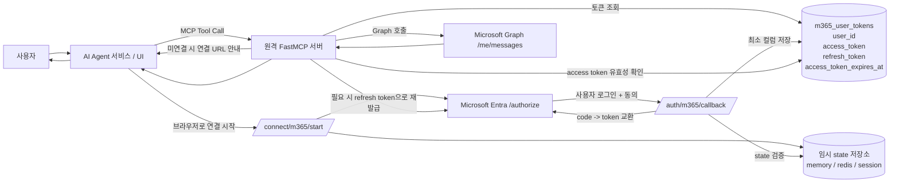

# 원격 FastMCP 기반 MS365 Mail 연동 설계 보고서

## 주제: AI Agent 서비스와 연결된 원격 MCP 서버에서 Microsoft 365 메일을 **Delegated Permission(위임 권한)** 으로 구현하는 방안

### 부제: **DB 최소 컬럼 저장 방식 기준**

## 1. 현재 상황과 주제

현재 목표는 **AI Agent 서비스가 원격 HTTP 기반 MCP 서버를 호출**하고, 이 MCP 서버가 **Microsoft 365 메일 기능을 delegated permission으로 제공**하는 것이다. 이 환경에서는 Azure App Registration에서 **Application Permission이 아니라 Delegated Permission만 사용 가능**하므로, 서버는 앱 자체 권한이 아니라 **사용자가 직접 로그인하고 동의한 범위 안에서만** Microsoft Graph를 호출해야 한다. 또한 MCP 관점에서는, third-party 서비스(Microsoft Graph)에 대한 자격증명은 **MCP client나 AI Agent 서비스로 전달되면 안 되고**, **MCP 서버가 직접 저장·관리하는 stateful 구조**가 되어야 한다.

이번 보고서는 이 구조를 **“DB 최소 컬럼 저장” 관점**으로 단순화해서 설명한다. 즉, DB에는 복잡한 토큰 캐시 전체를 저장하지 않고, **사용자 식별자와 access token, refresh token, 만료시각 정도만 저장**하는 실무형 최소 구조를 기준으로 정리한다. 다만 이 방식은 Microsoft가 일반적으로 권장하는 “MSAL token cache per user” 방식보다 구현자가 직접 갱신 로직을 더 많이 책임지는 구조라는 점은 분명히 인지해야 한다.

---

## 2. 당면 과제

### 2.1 사용자별 동의 확보

Delegated Permission은 사용자 컨텍스트가 필수이므로, **사용자마다 Microsoft 로그인 및 동의 절차**가 필요하다. `Mail.Read`, `Mail.ReadWrite`, `Mail.Send` 같은 delegated 권한은 기본적으로 사용자 동의가 가능한 범주이지만, 실제 고객 테넌트에서 **user consent 정책이 차단되어 있으면** 관리자 승인 흐름이 필요할 수 있다.

### 2.2 사용자별 토큰 영속 저장

원격 MCP 서버는 사용자가 다시 들어왔을 때 매번 처음부터 로그인시키지 않기 위해, **사용자별 refresh token을 영속 저장**해야 한다. Microsoft는 refresh token이 access token보다 오래 가고, 이를 통해 새 access token을 계속 발급받을 수 있다고 설명한다. 따라서 delegated 방식의 핵심은 **사용자별 refresh token 관리**라고 볼 수 있다.

### 2.3 토큰 갱신 처리

Access token은 짧게 살고, refresh token은 더 오래 간다. Microsoft는 access token이 짧게 유지되며, refresh token으로 새 access token을 받도록 안내한다. 또한 refresh token은 사용할 때 새 refresh token으로 교체될 수 있으므로, 갱신 성공 시 DB의 refresh token도 함께 교체 저장해야 한다.

### 2.4 AI Agent와 MCP 서버의 책임 분리

MCP 명세에서는 third-party credential이 **MCP client를 통과하면 안 되며**, MCP 서버가 이를 직접 저장하고 관리해야 한다고 명시한다. 따라서 Microsoft access token / refresh token은 **AI Agent 서비스가 아니라 MCP 서버가 소유**해야 한다. AI Agent는 단지 MCP tool을 호출하고, 필요할 때 사용자에게 “Microsoft 연결 URL”을 안내하는 역할만 담당하는 것이 맞다.

### 2.5 FastMCP / FastAPI 환경에서의 구현

FastMCP는 HTTP transport에서 `@custom_route`를 통해 일반 웹 엔드포인트를 추가할 수 있고, FastAPI에 mount도 가능하다. 따라서 OAuth 시작 URL, callback URL, 연결 완료 페이지는 모두 **FastAPI/FastMCP 내부 라우트**로 충분히 구현 가능하다.

---

## 3. 핵심 포인트

### 3.1 인증 방식 결론

권장 흐름은 **Authorization Code Flow + Confidential Client + Web Redirect URI** 이다. `offline_access`를 함께 요청해야 refresh token을 받을 수 있고, 서버형 앱에서는 `spa` redirect가 아니라 **일반 Web redirect URI** 를 사용해야 한다. `spa` redirect를 쓰면 refresh token 수명이 24시간으로 제한된다.

### 3.2 첫 동의 이후 재동의 여부

같은 앱, 같은 scope, 같은 사용자, 같은 tenant 정책이 유지되고 refresh token이 정상적으로 살아 있으면, **보통 최초 동의 이후 매번 다시 동의할 필요는 없다.** refresh token은 비-SPA 환경에서 기본적으로 더 긴 수명을 가지며, 이를 통해 access token을 다시 받을 수 있다. 다만 refresh token revoke, 비밀번호 변경, tenant 정책 변경, 추가 scope 요청 같은 경우에는 재인증 또는 재동의가 다시 필요해질 수 있다.

### 3.3 DB 최소 저장 방식 결론

이번 버전의 설계에서는 DB를 최대한 단순화하여, **사용자 1명당 토큰 1세트만 저장**하는 구조로 본다. 메인 DB에는 아래 네 컬럼만 두는 것이 현실적인 최소 구성이다.

- `user_id`
- `access_token`
- `refresh_token`
- `access_token_expires_at`

이 중 `access_token`은 사실상 캐시 용도이고, 핵심은 `refresh_token`이다. 이론적으로는 `user_id + refresh_token`만으로도 운영은 가능하지만, 그러면 매번 refresh를 시도하거나 401 이후에야 재발급하게 되어 비효율적이다. 그래서 **실무 최소 권장 컬럼은 4개**로 보는 것이 적절하다. 이 판단은 Microsoft의 “access token은 짧고 refresh token은 길다”는 구조를 운영적으로 단순화한 해석이다.

### 3.4 메인 DB와 임시 저장소의 분리

DB를 최소화하려면 OAuth `state` 같은 임시 값은 메인 DB에 넣지 않고, **메모리 / Redis / session storage** 같은 임시 저장소로 분리하는 것이 좋다. 이렇게 하면 메인 DB는 정말로 “사용자별 Microsoft 토큰 저장소” 역할만 하게 된다. FastMCP/FastAPI는 callback 라우트를 쉽게 붙일 수 있으므로 이 분리가 자연스럽다.

### 3.5 MCP 보안 경계

MCP 명세상, third-party credential은 MCP client를 지나가면 안 되고, MCP 서버가 직접 user identity와 바인딩하여 저장해야 한다. 따라서 DB 최소화는 가능하지만, **토큰 저장 책임을 MCP 서버 밖으로 빼는 것은 불가**하다고 보는 것이 맞다.

---

## 4. 구현 전략

### 4.1 전략 요약

- **권한 모델**: Microsoft Graph Delegated Permission
- **OAuth 흐름**: Authorization Code Flow
- **앱 유형**: Confidential Client / Web Redirect URI
- **토큰 저장 방식**: DB 최소 컬럼 저장
- **메인 DB 컬럼**: `user_id`, `access_token`, `refresh_token`, `access_token_expires_at`
- **임시 저장**: `state`는 memory/Redis/session
- **토큰 재발급 방식**: tool 호출 시 access token 유효성 확인 후 필요 시 refresh
- **토큰 소유권**: MCP 서버
- **AI Agent 역할**: 연결 시작 링크 안내 및 MCP tool 호출
- **전송 계층**: 현재 SSE 유지 가능하나, FastMCP 문서상 HTTP(Streamable)가 권장됨

### 4.2 최소 권한 범위

초기 scope는 아래처럼 최소 구성으로 시작하는 것이 적절하다.

- `openid`
- `profile`
- `offline_access`
- `User.Read`
- `Mail.Read`

이후 메일 발송이 필요하면 `Mail.Send`를 추가한다. delegated `Mail.Send`는 기본적으로 admin consent 필수는 아니지만, 고객 tenant 정책에 따라 사용자 동의가 차단될 수 있다.

### 4.3 최소 DB 구조

이번 설계에서 메인 DB는 아래 **단일 테이블 하나**면 충분하다.

### `m365_user_tokens`

- `user_id`
- `access_token`
- `refresh_token`
- `access_token_expires_at`

운영 원칙은 단순하다.

- `user_id`는 MCP 서버 입장에서의 사용자 식별자
- `access_token`은 현재 바로 Graph를 호출하기 위한 캐시
- `refresh_token`은 access token 재발급용 핵심 자격증명
- `access_token_expires_at`은 access token 만료 판단용

그리고 보안상 `access_token`과 `refresh_token`은 **평문 저장이 아니라 암호화 저장**이 필요하다. Microsoft도 refresh token은 access token이나 앱 자격증명처럼 안전하게 저장해야 한다고 안내한다.

### 4.4 운영 시퀀스

1. 사용자가 AI Agent에서 메일 관련 MCP tool 호출
2. MCP 서버가 DB에서 `user_id` 기준 토큰 존재 여부 확인
3. 토큰이 없으면 `/connect/m365/start` URL 안내
4. 사용자가 Microsoft 로그인/동의 수행
5. callback에서 authorization code를 access/refresh token으로 교환
6. DB에 `user_id | access_token | refresh_token | access_token_expires_at` 저장
7. 이후 tool 호출 시 access token이 유효하면 그대로 사용
8. 만료되었으면 refresh token으로 새 access token 요청
9. 응답에 새 refresh token이 오면 DB 값도 함께 교체
10. refresh 실패 시 재연결 요구

---

## 5. 아키텍처 구조 (도식화 머메이드)




이 구조의 핵심은 **메인 DB를 토큰 저장 전용으로 최소화**하고, OAuth 흐름에 필요한 `state`는 별도의 임시 저장소로 분리하는 점이다. 또한 MCP 규칙상 Microsoft 토큰은 MCP 서버 안에서만 관리되어야 하며, AI Agent나 MCP client로 전달되면 안 된다.

---

## 6. 구현 방법 (샘플코드 in FastAPI)

아래 샘플은 **DB 최소 컬럼 저장 방식**을 반영한 FastAPI/FastMCP 예시다.

이 예시는 **MSAL token cache 저장 방식이 아니라**, **authorization code와 refresh token을 직접 다루는 단순화 버전**이다. Microsoft는 일반적으로 인증 라이브러리 사용을 권장하지만, 이번 설계는 DB와 구조를 단순하게 보여주기 위한 목적의 예시다.

```
importos
importsecrets
fromdatetimeimportdatetime,timedelta,timezone
fromurllib.parseimporturlencode

importhttpx
fromfastapiimportFastAPI,HTTPException
fromfastmcpimportFastMCP
fromstarlette.requestsimportRequest
fromstarlette.responsesimportRedirectResponse,HTMLResponse

# --------------------------------------------------
# Settings
# --------------------------------------------------
CLIENT_ID=os.environ["MS_CLIENT_ID"]
CLIENT_SECRET=os.environ["MS_CLIENT_SECRET"]
TENANT_ID=os.environ["MS_TENANT_ID"]
REDIRECT_URI=os.environ["MS_REDIRECT_URI"]# ex: https://mcp.example.com/auth/m365/callback

AUTH_BASE=f"https://login.microsoftonline.com/{TENANT_ID}/oauth2/v2.0"
AUTHORIZE_URL=f"{AUTH_BASE}/authorize"
TOKEN_URL=f"{AUTH_BASE}/token"

SCOPES= ["openid","profile","offline_access","User.Read","Mail.Read"]

mcp=FastMCP("m365-mail-server")

# --------------------------------------------------
# 임시 state 저장소 (memory / redis 대체 가능)
# 메인 DB와 분리해서 단순화
# --------------------------------------------------
OAUTH_STATE_STORE= {}

# --------------------------------------------------
# 최소 DB 모델 (데모용 in-memory)
# 실제 운영에서는 PostgreSQL/MySQL 등 사용
# 컬럼 개념:
# user_id | access_token | refresh_token | access_token_expires_at
# --------------------------------------------------
TOKEN_DB= {}

defget_mcp_user_id(request:Request) ->str:
"""
    실제 운영에서는 JWT/session/MCP auth context에서 사용자 식별.
    데모에서는 헤더 사용.
    """
user_id=request.headers.get("x-user-id")
ifnotuser_id:
raiseHTTPException(status_code=401,detail="Missing MCP user identity")
returnuser_id

defsave_tokens(user_id:str,access_token:str,refresh_token:str,expires_in:int) ->None:
# 2분 정도 여유를 두고 만료시각 저장
expires_at=datetime.now(timezone.utc)+timedelta(seconds=max(expires_in-120,0))
TOKEN_DB[user_id]= {
"access_token":access_token,
"refresh_token":refresh_token,
"access_token_expires_at":expires_at,
    }

defget_user_tokens(user_id:str):
returnTOKEN_DB.get(user_id)

defaccess_token_valid(row:dict) ->bool:
ifnotrow:
returnFalse
expires_at=row["access_token_expires_at"]
returndatetime.now(timezone.utc)<expires_at

asyncdefrefresh_access_token(user_id:str) ->str:
row=get_user_tokens(user_id)
ifnotrowornotrow.get("refresh_token"):
raiseRuntimeError("m365_not_connected")

payload= {
"client_id":CLIENT_ID,
"client_secret":CLIENT_SECRET,
"grant_type":"refresh_token",
"refresh_token":row["refresh_token"],
"redirect_uri":REDIRECT_URI,
"scope":" ".join(SCOPES),
    }

asyncwithhttpx.AsyncClient(timeout=20)asclient:
resp=awaitclient.post(TOKEN_URL,data=payload)

ifresp.status_code!=200:
raiseRuntimeError("m365_reauth_required")

token_data=resp.json()

new_access_token=token_data["access_token"]
new_refresh_token=token_data.get("refresh_token",row["refresh_token"])
expires_in=int(token_data.get("expires_in",3600))

save_tokens(user_id,new_access_token,new_refresh_token,expires_in)
returnnew_access_token

asyncdefget_valid_access_token(user_id:str) ->str:
row=get_user_tokens(user_id)
ifnotrow:
raiseRuntimeError("m365_not_connected")

ifaccess_token_valid(row):
returnrow["access_token"]

returnawaitrefresh_access_token(user_id)

# --------------------------------------------------
# OAuth 시작 라우트
# --------------------------------------------------
@mcp.custom_route("/connect/m365/start",methods=["GET"])
asyncdefconnect_m365_start(request:Request):
user_id=get_mcp_user_id(request)
state=secrets.token_urlsafe(32)

OAUTH_STATE_STORE[state]= {
"user_id":user_id,
"created_at":datetime.now(timezone.utc),
    }

params= {
"client_id":CLIENT_ID,
"response_type":"code",
"redirect_uri":REDIRECT_URI,
"response_mode":"query",
"scope":" ".join(SCOPES),
"state":state,
    }

returnRedirectResponse(f"{AUTHORIZE_URL}?{urlencode(params)}")

# --------------------------------------------------
# OAuth callback 라우트
# --------------------------------------------------
@mcp.custom_route("/auth/m365/callback",methods=["GET"])
asyncdefconnect_m365_callback(request:Request):
state=request.query_params.get("state")
code=request.query_params.get("code")

ifnotstateorstatenotinOAUTH_STATE_STORE:
returnHTMLResponse("Invalid or expired state",status_code=400)

ifnotcode:
returnHTMLResponse("Missing authorization code",status_code=400)

saved=OAUTH_STATE_STORE.pop(state)
user_id=saved["user_id"]

payload= {
"client_id":CLIENT_ID,
"client_secret":CLIENT_SECRET,
"grant_type":"authorization_code",
"code":code,
"redirect_uri":REDIRECT_URI,
"scope":" ".join(SCOPES),
    }

asyncwithhttpx.AsyncClient(timeout=20)asclient:
resp=awaitclient.post(TOKEN_URL,data=payload)

ifresp.status_code!=200:
returnHTMLResponse(f"Microsoft 365 연결 실패:{resp.text}",status_code=400)

token_data=resp.json()

access_token=token_data["access_token"]
refresh_token=token_data["refresh_token"]
expires_in=int(token_data.get("expires_in",3600))

save_tokens(user_id,access_token,refresh_token,expires_in)

returnHTMLResponse("""
    <html>
      <body>
        <h3>Microsoft 365 연결 완료</h3>
        <p>이제 AI Agent 서비스에서 메일 도구를 사용할 수 있습니다.</p>
      </body>
    </html>
    """)

# --------------------------------------------------
# MCP Tool: 메일 목록 조회
# --------------------------------------------------
@mcp.tool()
asyncdeflist_my_messages(user_id:str,top:int=10) ->dict:
"""
    데모용.
    실제 운영에서는 user_id를 tool input으로 받지 말고
    서버 인증 컨텍스트에서 추출하는 것이 안전하다.
    """
access_token=await get_valid_access_token(user_id)

asyncwithhttpx.AsyncClient(timeout=20)asclient:
resp=awaitclient.get(
"https://graph.microsoft.com/v1.0/me/messages",
headers={"Authorization":f"Bearer{access_token}"},
params={
"$top":top,
"$select":"id,subject,from,receivedDateTime,isRead",
"$orderby":"receivedDateTime DESC",
            },
        )

# access token이 예상과 다르게 만료/무효 처리된 경우 한 번 재시도 가능
ifresp.status_code==401:
access_token=awaitrefresh_access_token(user_id)
asyncwithhttpx.AsyncClient(timeout=20)asclient:
resp=awaitclient.get(
"https://graph.microsoft.com/v1.0/me/messages",
headers={"Authorization":f"Bearer{access_token}"},
params={
"$top":top,
"$select":"id,subject,from,receivedDateTime,isRead",
"$orderby":"receivedDateTime DESC",
                },
            )

ifresp.status_code==401:
raiseRuntimeError("m365_reauth_required")

resp.raise_for_status()
data=resp.json()

return {
"count":len(data.get("value", [])),
"messages":data.get("value", []),
    }

# --------------------------------------------------
# FastAPI mount
# --------------------------------------------------
mcp_app=mcp.http_app(path="/")
app=FastAPI(lifespan=mcp_app.lifespan)
app.mount("/mcp",mcp_app)
```

### 코드 설명

- `/connect/m365/start`: Microsoft 동의 화면으로 이동시키는 시작점
- `/auth/m365/callback`: authorization code를 access/refresh token으로 교환
- `TOKEN_DB`: 최소 컬럼 구조를 표현한 토큰 저장소
- `get_valid_access_token()`: access token이 살아 있으면 그대로 쓰고, 아니면 refresh
- `refresh_access_token()`: 새 access token과 새 refresh token이 오면 DB 교체 저장
- `list_my_messages()`: Graph `/me/messages` 호출
- `app.mount("/mcp", mcp_app)`: FastAPI 안에 MCP 서버 탑재

FastMCP는 HTTP transport에서 custom route를 붙일 수 있고, FastAPI에 mount도 가능하므로 이런 구조가 자연스럽다.

---

## 7. 기타 사항

### 7.1 3컬럼만으로도 가능한가

가능은 하다.

극단적으로는 아래처럼 더 줄일 수 있다.

- `user_id`
- `refresh_token`
- `access_token` 또는 없음

하지만 `access_token_expires_at`가 없으면,

- 매 호출마다 refresh를 시도하거나
- Graph에서 401을 받은 뒤에야 refresh 해야 하므로

운영 효율이 떨어진다. 그래서 **실무 최소 권장안은 4컬럼**이라고 보는 것이 좋다. 이건 문서의 직접 문구라기보다, Microsoft의 access token / refresh token 구조를 실제 서비스 운영 관점으로 단순화한 설계 판단이다.

### 7.2 refresh token 교체 규칙

Microsoft는 refresh token 사용 시 **새 refresh token이 반환될 수 있으며**, 이 경우 이전 refresh token은 폐기하고 새 값으로 교체 저장하라고 안내한다. 따라서 DB 최소화 버전에서도 **refresh 성공 시 refresh token 컬럼은 항상 overwrite 가능하도록** 설계해야 한다.

### 7.3 refresh token 수명

비-SPA 시나리오에서는 refresh token 기본 수명이 **90일**이다. 다만 Microsoft는 동시에 “web app refresh token은 고정 수명이 명시되지 않고 일반적으로 길다”는 표현도 함께 사용하며, 실제로는 revoke나 정책 변화 등으로 더 일찍 무효화될 수 있으므로 **절대 보장되는 90일 고정값처럼 운영하면 안 된다.** 실무적으로는 “보통 길게 유지되지만, 언제든 실패 가능”으로 받아들이는 것이 안전하다.

### 7.4 첫 동의 후 장기 재사용 가능성

사용자가 90일 이내에 주기적으로 도구를 사용하고 refresh가 계속 성공한다면, **이론상 최초 동의 이후 장기간 재동의 없이 유지**될 수 있다. 다만 추가 scope 요청, user consent 정책 변경, 보안 정책, 비밀번호 변경, revoke 상황은 예외다.

### 7.5 권한 추가 시 동작

초기에 `Mail.Read`만 받고 운영하다가, 이후 `Mail.Send`가 필요해지면 사용자는 그 **추가 권한에 대해 다시 동의**해야 한다. 즉 “재동의가 전혀 없다”가 아니라, **같은 권한 세트에서는 반복 동의가 거의 없고, 권한이 늘어나면 다시 동의가 필요**하다고 이해하면 정확하다.

### 7.6 FastMCP 전송 계층

FastMCP 문서 기준으로 HTTP(Streamable)는 네트워크 배포에 권장되는 전송 방식이고, **SSE는 legacy/deprecated** 로 표시된다. 현재 SSE를 쓰고 있어도 동작은 가능하지만, 중장기적으로는 Streamable HTTP 전환을 검토하는 편이 좋다.

### 7.7 보안 원칙

- Microsoft 토큰은 **MCP 서버만 저장**
- MCP client / AI Agent 서비스는 Microsoft 토큰을 보지 않음
- third-party credential은 MCP client를 통과하면 안 됨
- refresh token은 안전하게 저장해야 함
- 메인 DB 컬럼은 최소화하더라도 **암호화 저장과 HTTPS, state 검증은 생략하면 안 됨**

---

## 8. 최종 결론

이번 최소화 버전의 결론은 명확하다.

**원격 FastMCP 서버가 Microsoft 365 delegated permission 기반 OAuth를 직접 수행하고, DB에는 `user_id | access_token | refresh_token | access_token_expires_at`만 저장하는 단순 구조로도 충분히 구현 가능하다.** 이 구조는 MSAL token cache 전체를 저장하는 방식보다 단순하며, PPT나 초기 설계 설명용으로도 훨씬 직관적이다. 다만 그만큼 **토큰 갱신 로직과 오류 처리 책임은 서버 구현 쪽으로 더 이동**한다는 점을 감안해야 한다.

즉, 이 프로젝트의 추천 요약은 다음 한 문장으로 정리할 수 있다.

**“AI Agent는 MCP를 호출하고, 원격 FastMCP 서버는 사용자별 Microsoft 동의를 직접 받아 최소 컬럼 DB에 토큰을 저장한 뒤, refresh token 기반으로 Graph 메일 API를 재사용 호출한다.”**