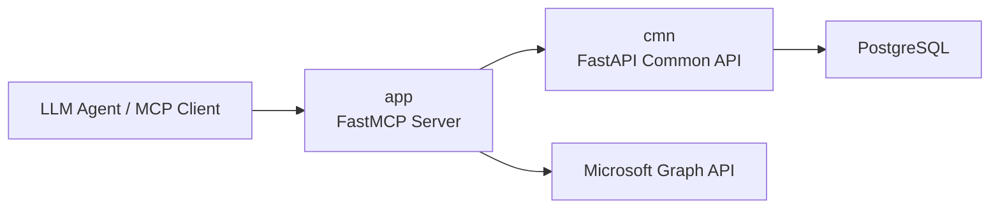
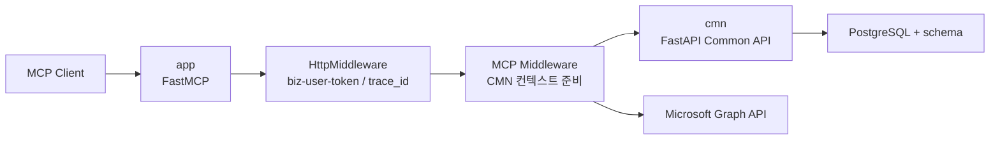
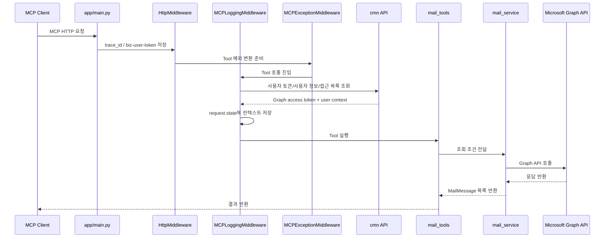
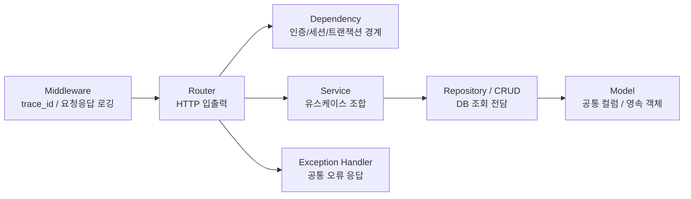
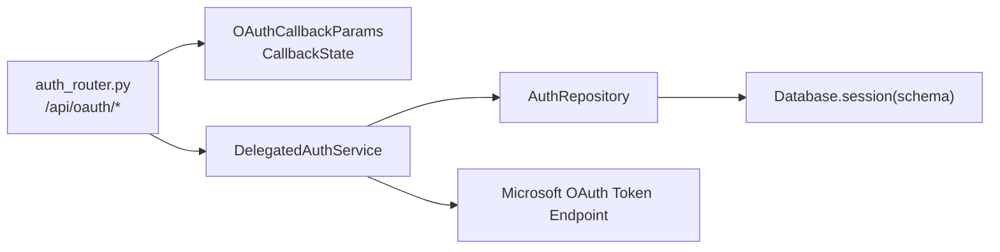
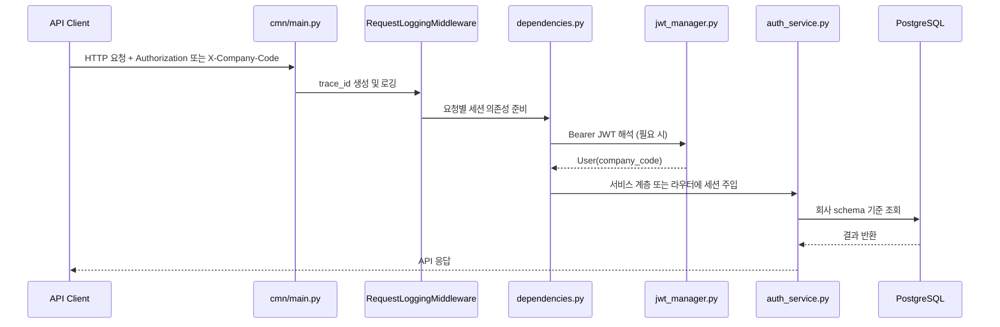

# mcp-mail

`mcp-mail`은 Microsoft 365 연동을 위한 서비스 코드베이스입니다.  
현재 저장소는 두 개의 앱을 중심으로 구성됩니다.

- `app`: FastMCP 기반 MCP 서버
- `cmn`: FastAPI 기반 공통 API 서버

이 저장소는 기능을 빠르게 붙이는 것보다, MCP 실행 계층과 공통 API 계층의 책임을 분리해 이후 확장과 운영에서 덜 흔들리는 구조를 만드는 데 초점을 두고 정리했습니다.  
구조적으로는 공통 서버 1개와 MCP 서버 N개로 확장 가능한 MSA 아키텍처를 전제로 설계하고 있습니다.  
README는 "구상 중인 역할"과 "현재 코드 기준 상태"를 함께 적어, 설계 의도와 실제 구현이 어디까지 와 있는지 바로 읽히도록 구성했습니다.

## 역할 요약

| 영역 | 목표 역할 | 현재 코드 기준 상태 |
| :-- | :-- | :-- |
| `app` | LLM/에이전트가 호출하는 MCP 서버 | FastMCP 서버로 구성되어 있고, 현재는 메일 조회 중심으로 연결되어 있으며 향후 서비스별 독립 배포 단위로 확장할 MCP 서버 역할입니다. |
| `cmn` | 인증, 토큰, 로그, DB 세션 등 공통 기능을 제공하는 API 서버 | FastAPI 앱으로 분리되어 있으며, OAuth 콜백, 사용자 토큰 조회, 앱 토큰 발급, JWT encode/decode 유틸, Tool/API 로그 저장 API를 제공하는 공통 플랫폼 레이어 역할을 맡고 있습니다. |

## 최근 로컬 `main` 반영 사항

- `app`은 더 이상 자체 JWT 해석, OAuth 보조 라우트, 메모리 토큰 매니저를 중심으로 동작하지 않고, `biz-user-token`을 받아 `cmn`의 사용자 토큰 API에서 Tool 실행 컨텍스트를 준비하는 구조로 정리되었습니다.
- `app/core/mcp_midleware.py`에 Tool 실행 전 사용자 컨텍스트를 준비하는 `MCPLoggingMiddleware`와 Tool 예외를 `ToolError`로 변환하는 `MCPExceptionMiddleware`가 함께 등록되었습니다.
- `app/clients/mcp_cmn_client.py`가 추가되어 `cmn`의 `/api/oauth/user/token/{app_name}`, `/api/logs/tool`, `/api/logs/api` 호출을 담당합니다.
- `app/service/mail_service.py`와 `app/schema/mail.py`가 추가되어 Tool 함수에서 Graph 조회 조건 조합과 응답 모델 변환을 분리했습니다.
- 메일 조회는 KST 기준 날짜 입력(`YYYY-MM-DD`)을 Graph API용 UTC `Z` 필터로 변환하고, 날짜가 없으면 최근 30일 범위를 기본 조회 조건으로 사용합니다.
- `app/clients/graph_client.py`는 access token 발급이나 사용자 판단을 하지 않고, service 계층에서 전달받은 Graph access token으로 Microsoft Graph를 호출하고 외부 API 로그를 남기는 역할로 좁혔습니다.
- `cmn/api/endpoint/utils_router.py`가 추가되어 JWT `encode`/`decode` 검증용 유틸 API를 제공합니다.
- 로그 모델은 `cmn/db/models/mcp_log.py`의 `LogBase`를 기준으로 재정리되었고, `M365McpToolLog`, `M365McpApiLog` 두 모델이 공통 저장 흐름을 공유합니다.
- `cmn/core/dependencies.py`의 `get_db_session_authorize_header()`가 Bearer JWT에서 `company_code`를 해석해 세션을 열고, 요청 종료 시 `commit` 또는 `rollback`을 수행합니다.
- `cmn/api/endpoint/auth_router.py`가 `/api/oauth` 기준 엔드포인트로 정리되었고, 사용자 위임 토큰 조회/갱신 API인 `/api/oauth/user/token/{app_name}`가 추가되었습니다.
- `cmn/services/delegated_auth_service.py`가 도입되면서 OAuth callback 처리와 사용자 위임 토큰 재발급 로직이 `Router -> Service -> Repository` 흐름으로 재구성되었습니다.
- 콜백 입력은 `cmn/schemas/callback.py`의 `OAuthCallbackParams`, `CallbackState`로 분리했고, 외부 토큰 응답과 API 반환 모델도 `TokenData`, `MyAccessToken`으로 나눠 service 시그니처를 명시적으로 정리했습니다.


## 현재 디렉터리 구조

```text
mcp-mail/
├─ app/                         # FastMCP 기반 MCP 서버
│  ├─ main.py                   # MCP 앱 조립 진입점
│  ├─ server.py                 # 최소 예제 FastMCP 서버
│  ├─ clients/                  # Graph/HTTP/CMN 클라이언트
│  ├─ common/                   # 공통 로거 및 예외 정의
│  ├─ core/                     # 설정, HTTP/MCP 미들웨어
│  ├─ schema/                   # Tool/API 입출력 스키마
│  ├─ service/                  # Tool 유스케이스 서비스 계층
│  └─ tools/                    # MCP Tool 모음
├─ cmn/                         # FastAPI 기반 공통 API 서버
│  ├─ main.py                   # FastAPI 앱 조립 진입점
│  ├─ api/                      # 라우터, 엔드포인트
│  ├─ base/                     # 예외 처리, 로깅, 미들웨어
│  ├─ core/                     # 설정, DB, DI
│  ├─ db/                       # 모델, CRUD
│  ├─ repositories/             # DB 접근 계층
│  ├─ schemas/                  # 응답 스키마
│  ├─ services/                 # 서비스 계층
│  ├─ static/                   # Swagger 정적 리소스
│  └─ utils/                    # 토큰/유틸리티
├─ docs/                        # 각종 가이드 문서
├─ requirements.txt
└─ README.md
```

## 아키텍처

### 1. 목표 아키텍처



- `app`은 MCP 프로토콜 처리와 Tool 실행에 집중합니다.
- `cmn`은 인증, 토큰, 로그, 회사별 스키마 세션 같은 공통 기능을 맡습니다.
- 이렇게 분리하면 MCP 서버와 공통 API 서버의 책임이 섞이지 않고, 각 서버를 독립 배포 단위로 가져가기 쉬워집니다.
- 실제 운영도 서비스별 Helm chart와 서비스별 CI 파이프라인을 따로 가져가는 방향을 전제로 두고 있습니다.
- 관련 코드 경로는 `app/main.py`, `cmn/main.py`, `cmn/core/database.py` 입니다.

### 2. 현재 코드 기준 상태



- `app`은 HTTP 헤더의 `biz-user-token`을 직접 해석하지 않고 `request.state`에 보관합니다.
- Tool 호출 직전 `MCPLoggingMiddleware`가 `cmn`의 사용자 위임 토큰 API를 호출해 Graph access token, 사용자 정보, 접근 제어 목록을 준비합니다.
- `app`의 service 계층은 준비된 요청 컨텍스트를 읽어 비즈니스 검사를 수행하고, `graph_client.py`는 Graph 호출과 외부 API 로깅만 담당합니다.
- 관련 코드 경로는 `app/core/http_middleware.py`, `app/core/mcp_midleware.py`, `app/clients/mcp_cmn_client.py`, `app/service/mail_service.py`, `app/clients/graph_client.py`, `cmn/api/endpoint/auth_router.py` 입니다.

## `app` 설명

`app`은 FastMCP 서버입니다.  
LLM 또는 MCP 클라이언트가 이 서버의 Tool을 호출하면, 서버가 Microsoft Graph API를 대신 호출해서 결과를 반환합니다.

### 주요 코드

| 파일 | 설명 |
| :-- | :-- |
| `app/main.py` | FastMCP 앱 생성, 미들웨어 등록, Tool 등록 |
| `app/tools/mail_tools.py` | 메일 관련 MCP Tool 정의 |
| `app/service/mail_service.py` | 메일 조회 조건 조합, 사용자 접근 검사, Graph 호출 유스케이스 |
| `app/schema/mail.py` | Graph 메일 응답 모델과 KST 시간 변환 |
| `app/clients/graph_client.py` | Microsoft Graph API 호출 공통 래퍼 및 외부 API 로그 기록 |
| `app/clients/mcp_cmn_client.py` | CMN 사용자 컨텍스트 조회, Tool/API 로그 저장 호출 |
| `app/common/exception.py` | Graph/CMN 예외 정의 |
| `app/core/http_middleware.py` | `x-request-id`, `biz-user-token` 처리 |
| `app/core/mcp_midleware.py` | Tool 실행 전 사용자 컨텍스트 준비, Tool 로그 기록, Tool 예외 변환 |

### 현재 활성화된 MCP 기능

- `register_mail_tools(mcp)`가 등록되어 있습니다.
- 실제 활성 Tool은 현재 `get_recent_emails`, `get_unread_emails` 입니다.
- 두 Tool은 공통으로 `MailService.fetch_my_mails()`를 호출하고, 날짜가 없으면 KST 기준 최근 30일 범위를 기본 필터로 사용합니다.
- `from_date`, `to_date`는 `YYYY-MM-DD` 형식의 KST 날짜로 해석되며, Microsoft Graph 호출 전 UTC `Z` 형식의 `receivedDateTime` 필터로 변환됩니다.
- Teams, SharePoint 등의 Tool 모듈은 존재하지만 `app/main.py`에서는 아직 등록이 주석 처리되어 있습니다.

### `app` 요청 흐름



- `HttpMiddleware`는 `x-request-id`, `biz-user-token` 요청 헤더를 읽어 `request.state`에 값을 보관합니다.
- `MCPLoggingMiddleware`는 Tool 실행 전에 `cmn`에서 사용자 컨텍스트를 조회하고, Tool 실행 후 성공/실패 로그를 `/api/logs/tool`로 저장합니다.
- `MCPExceptionMiddleware`는 Graph/CMN 예외와 예상하지 못한 예외를 FastMCP `ToolError`로 변환합니다.
- `mail_service.py`는 blacklist 검사, KST 날짜 필터 조합, Graph 호출 요청 조립을 담당합니다.
- `graph_client.py`는 실제 Graph API 호출을 감싸고, 외부 API 호출 로그를 `/api/logs/api`로 저장합니다.
- 관련 코드 경로는 `app/core/http_middleware.py`, `app/core/mcp_midleware.py`, `app/clients/mcp_cmn_client.py`, `app/service/mail_service.py`, `app/clients/graph_client.py` 입니다.

## `cmn` 설명

`cmn`은 FastAPI 기반 공통 API 서버입니다.  
현재는 DB 연결, 회사별 스키마 처리, OAuth 콜백, 사용자 토큰 조회, 앱 토큰 발급, JWT 유틸, Tool/API 로그 저장을 한곳에서 다루는 공통 백엔드 레이어로 정리하고 있습니다.  
단순히 엔드포인트를 모아 둔 앱이 아니라, 인증 문맥, 멀티테넌트 세션, 로그, 예외 처리처럼 여러 API에서 반복되는 책임을 한 단계 아래에서 흡수하도록 설계한 영역입니다.

이 분리는 단순한 폴더 정리가 아니라, `cmn`을 공통 플랫폼 서버로 두고 업무별 MCP 서버를 별도 배포하는 MSA 운영 모델을 염두에 둔 선택입니다.  
즉 `cmn`과 각 MCP 서버는 코드 경계뿐 아니라 배포 단위와 운영 파이프라인도 각각 가져갈 수 있도록 나눠 두었습니다.

### 주요 코드

| 파일 | 설명 |
| :-- | :-- |
| `cmn/main.py` | FastAPI 앱 생성, lifespan, Swagger, 미들웨어 등록 |
| `cmn/api/routers.py` | 엔드포인트 라우터 등록 |
| `cmn/api/endpoint/auth_router.py` | 앱 토큰 발급, M365 delegated callback, 사용자 위임 토큰 조회/갱신 API |
| `cmn/api/endpoint/logs_router.py` | Tool 로그 / 외부 API 로그 저장 API |
| `cmn/api/endpoint/utils_router.py` | 로컬 환경에서만 여는 JWT encode/decode 유틸 API |
| `cmn/core/database.py` | SQLAlchemy Async 엔진 및 schema session 제공 |
| `cmn/core/dependencies.py` | `Authorization` 또는 `X-Company-Code` 기반 DB 세션 DI |
| `cmn/services/auth_service.py` | 앱 토큰 발급 서비스 로직 |
| `cmn/services/delegated_auth_service.py` | OAuth callback 처리와 사용자 delegated token 조회/갱신 유스케이스 조합 |
| `cmn/repositories/auth_repository.py` | Graph 설정 조회 및 사용자 토큰 저장/조회 전담 |
| `cmn/db/models/mcp_log.py` | 로그 공통 추상 모델(`LogBase`)과 로그 엔티티 |
| `cmn/utils/jwt_manager.py` | JWT 생성/해석 및 현재 사용자 복원 |
| `cmn/base/middleware.py` | 요청/응답 로깅 미들웨어 |
| `cmn/base/exception.py` | 전역 예외 처리 핸들러 |

### `cmn`에 담은 엔터프라이즈 설계 포인트

`cmn`은 공통 기능을 한곳에 모으는 데서 끝내지 않고, 라우터, 의존성, 서비스, 저장 계층, 공통 모델, 미들웨어를 나눠도 기능이 유지되도록 설계한 FastAPI 레이어입니다.  
실제로는 아직 과도기 구조가 남아 있지만, 어떤 책임을 어디에 두어야 이후 기능 추가와 운영 대응이 쉬운지 먼저 정리해 두는 방식으로 다듬고 있습니다.

이 설계는 코드 계층 분리만을 위한 것이 아니라, 장기적으로는 `공통 서버 1 + MCP 서버 N` 형태의 독립 배포 구조를 안정적으로 운영하기 위한 기반이기도 합니다.  
서비스별 Helm chart, 서비스별 CI/CD, 서비스별 장애 격리를 고려하면 공통 기능과 실행 기능을 같은 앱 안에 계속 묶어 두는 것보다 현재 구조가 훨씬 운영 친화적입니다.



- 라우터는 HTTP 계약과 스키마 바인딩에 집중시켜, 요청 형식 변경이 비즈니스 로직까지 번지지 않도록 정리했습니다.
- dependency는 `Authorization`, `X-Company-Code`, `state` 같은 입력을 받아 인증 문맥, tenant schema 세션, 트랜잭션 경계를 맞추는 어댑터 역할을 합니다.
- 서비스는 토큰 발급 같은 유스케이스를 조합하고, 저장소/CRUD는 DB 조회 책임을 분리해 외부 연동과 데이터 접근이 한 파일에 엉키지 않도록 했습니다.
- 모델은 `AuditMixin`, `LogBase`처럼 공통 컬럼과 저장 객체 표현을 담당하고, 미들웨어와 전역 예외 핸들러는 로깅/오류 응답 같은 횡단 관심사를 애플리케이션 바깥으로 분리합니다.
- 관련 코드 경로는 `cmn/api/routers.py`, `cmn/core/dependencies.py`, `cmn/services/auth_service.py`, `cmn/db/models/mcp_log.py`, `cmn/base/middleware.py`, `cmn/base/exception.py` 입니다.

### delegated OAuth를 서비스 레이어로 끌어올린 이유

`cmn`에서 가장 공을 들인 부분 중 하나는 Microsoft 365 delegated OAuth 흐름을 단순 callback 핸들러가 아니라, 엔터프라이즈 서비스처럼 재사용 가능한 유스케이스로 정리한 점입니다. `DelegatedAuthService`는 브라우저 redirect callback과 `/api/oauth/user/token/{app_name}` 토큰 조회 API가 공통으로 쓰는 토큰 교환, Graph 설정 조회, 사용자 토큰 저장 로직을 한곳에서 조합합니다.



- 콜백 입력은 `OAuthCallbackParams`로 정규화하고, 내부에서는 `CallbackState` 값 객체로 다시 해석해 HTTP 입력과 비즈니스 문맥을 분리했습니다.
- DB 세션은 service가 필요한 시점에만 `async with db.session(schema)`로 여는 late-open 방식이라, 외부 HTTP 호출 중에 세션을 오래 물고 있지 않습니다.
- repository는 Graph 설정 조회와 사용자 토큰 저장/조회만 담당하고, callback HTML 응답과 API JSON 응답은 service가 각각의 채널 특성에 맞게 마무리합니다.
- 관련 코드 경로는 `cmn/api/endpoint/auth_router.py`, `cmn/services/delegated_auth_service.py`, `cmn/repositories/auth_repository.py`, `cmn/schemas/callback.py`, `cmn/schemas/token.py`, `cmn/schemas/credentials.py` 입니다.

### `cmn` API 흐름



- `get_db_session_authorize_header()`는 Bearer JWT를 해석해 `company_code`를 꺼내고, 요청 종료 시 `commit` 또는 `rollback`을 수행합니다.
- `Database.session()`은 `async with db.session(schema)` 형태의 세션 컨텍스트를 제공하고, 실제 트랜잭션 확정은 dependency 레이어에서 마무리합니다.
- 관련 코드 경로는 `cmn/core/dependencies.py`, `cmn/core/database.py`, `cmn/services/auth_service.py`, `cmn/utils/jwt_manager.py` 입니다.

### 현재 제공 중인 엔드포인트

| 메서드 | 경로 | 설명 |
| :--: | :-- | :-- |
| `GET` | `/api/oauth/` | 앱 권한(Client Credentials) 토큰 발급 요청 |
| `GET` | `/api/oauth/m365/callback/{app_name}` | M365 delegated OAuth 콜백 처리 |
| `GET` | `/api/oauth/user/token/{app_name}` | 사용자 위임 토큰 조회 및 필요 시 refresh token으로 갱신 |
| `POST` | `/api/logs/tool` | Tool 실행 로그 저장 |
| `POST` | `/api/logs/api` | 외부 API 호출 로그 저장 |
| `GET` | `/utils/jwt/decode` | 로컬 환경에서 Bearer JWT를 해석해 현재 사용자 정보 반환 |
| `POST` | `/utils/jwt/encode` | 로컬 환경에서 `User` 스키마를 JWT 문자열로 인코딩 |
| `POST` | `/health` | 서버 상태 확인 |

- 이전 README에 있던 `/api/logs/graph` placeholder 설명은 현재 로컬 `main` 기준 `/api/logs/api` 엔드포인트로 대체되었습니다.
- `utils_router`는 `ENV=local` 일 때만 라우터에 등록되므로, 운영 환경 문서와 개발 편의 기능을 구분해 두었습니다.

## 현재 구현에서 보이는 포인트

### 장점

- `app`과 `cmn`이 디렉터리 레벨에서 이미 분리되어 있어, MCP 실행 책임과 공통 플랫폼 책임을 다른 축으로 관리할 수 있습니다.
- `cmn`은 서비스, 저장소, DI, DB 모델이 나뉘어 있어 기능 추가보다 유지보수와 확장 기준을 먼저 세운 구조라는 점이 분명합니다.
- delegated OAuth 흐름도 callback 전용 코드를 라우터에 두지 않고, DTO 정규화와 late session open 패턴으로 service에 모아 두어 이후 토큰 조회/갱신 시나리오까지 재사용할 수 있습니다.
- `app`은 미들웨어, Tool, service, schema, 클라이언트가 나뉘어 있어 MCP 서버 확장과 공통 API 진화를 서로 독립적으로 가져가기 좋습니다.
- 폴더 분리가 곧 배포 경계이기도 해서, 향후 서비스별 Helm chart와 CI 파이프라인을 따로 가져가도 구조를 다시 뜯어고칠 필요가 적습니다.

### 정리 필요 포인트

- `app`은 이제 JWT 해석과 토큰 저장 책임을 직접 갖지 않고, `biz-user-token`을 CMN 사용자 컨텍스트 조회에 전달하는 실행 계층으로 정리되어 있습니다.
- `app`의 Graph 호출은 service 계층에서 access token을 명시적으로 전달하는 구조로 바뀌었으므로, 이후 Teams/SharePoint Tool도 같은 컨텍스트 전달 방식을 맞추는 정리가 필요합니다.
- `cmn` 내부에서는 이미 라우터, dependency, 서비스, 저장소, 공통 모델, 미들웨어, 예외 처리기를 나눠 두어 공통 플랫폼 서버 방향을 유지하고 있습니다.

이렇게 적어 둔 이유는 현재 저장소가 "완성된 분리 구조"라기보다 "의도를 가진 채 분리해 가는 구조"에 가깝기 때문입니다.  
README에서 이 차이를 숨기지 않으면, 지금 설계 판단과 이후 리팩토링 방향을 함께 설명할 수 있고 문서도 코드와 어긋나지 않습니다.

대안으로는 README를 목표 구조만 중심으로 단순하게 쓰는 방법도 있습니다.  
다만 그 경우 지금 코드를 처음 보는 사람이 실제 구현과 문서를 맞춰보며 혼란을 겪을 수 있다는 트레이드오프가 있습니다.

## 실행 방법

### 1. 의존성 설치

```bash
python -m pip install -r requirements.txt
```

전제조건:
- Python 3.11 이상 권장
- `.venv` 가상환경이 준비되어 있어야 합니다.
- `.env` 파일 필요

기대 결과:
- FastAPI, FastMCP, SQLAlchemy, httpx 등 필수 패키지가 설치됩니다.

실패 예시:
- `ModuleNotFoundError` 또는 빌드 오류가 발생하면 가상환경이 활성화되지 않았을 수 있습니다.
- Windows Git Bash 또는 보안 정책 환경에서는 `bash: .../.venv/Scripts/pip: Permission denied`가 발생할 수 있습니다.

해결 방법:
- PowerShell: `.\.venv\Scripts\Activate.ps1` 실행 후 `python -m pip install -r requirements.txt`를 다시 실행합니다.
- Git Bash: `source .venv/Scripts/activate` 후에도 `pip` 대신 `python -m pip install -r requirements.txt`를 사용합니다.
- 자세한 원인과 우회 방법은 `docs/WINDOWS_PIP_PERMISSION_GUIDE.md`를 참고합니다.

### 2. `cmn` 서버 실행

```bash
uvicorn cmn.main:app --host 0.0.0.0 --port 8004
```

전제조건:
- `DATABASE_URL`, `COMPANY_CODES` 등이 `.env`에 설정되어 있어야 합니다.

기대 결과:
- `http://localhost:8004/docs` 또는 환경별 `root_path` 기준 Swagger UI에 접속할 수 있습니다.

### 3. `app` 서버 실행

```bash
uvicorn app.main:app --host 0.0.0.0 --port 8002
```

전제조건:
- `CMN_API_BASE_URL`, `M365_USER_TOKEN_APP_NAME`, `LOG_LEVEL` 등이 `.env`에 있어야 합니다.
- MCP 요청에는 사용자 컨텍스트 조회를 위한 `biz-user-token` 헤더가 필요합니다.

기대 결과:
- MCP HTTP 엔드포인트가 `/mcp` 경로에 열립니다.

### 4. MCP Inspector 연결

```bash
npx @modelcontextprotocol/inspector
```

설정값:
- Transport Type: `streamable-http`
- URL: `http://127.0.0.1:8002/mcp`

## 환경 변수

### `app` 주요 환경 변수

| 변수명 | 설명 |
| :-- | :-- |
| `LOG_LEVEL` | 로그 레벨 |
| `ENV` | 실행 환경 |
| `AUTH_JWT_USER_TOKEN` | 레거시 호환용 설정 |
| `CMN_API_BASE_URL` | `app`이 사용자 컨텍스트와 로그 저장을 위해 호출하는 `cmn` API 기본 주소 |
| `CMN_API_TIMEOUT_SECONDS` | `cmn` 내부 API 호출 타임아웃 설정 |
| `M365_USER_TOKEN_APP_NAME` | 사용자 위임 토큰 조회 시 사용할 앱 이름, 기본값은 `MAIL` |
| `MS365_CONFIGS` | 회사별 M365 설정 JSON |
| `GRAFANA_ENDPOINT` | Grafana OTLP endpoint |

### `cmn` 주요 환경 변수

| 변수명 | 설명 |
| :-- | :-- |
| `DATABASE_URL` | PostgreSQL Async 연결 문자열 |
| `COMPANY_CODES` | 허용할 회사 코드 목록 |
| `JWT_SECRET_KEY` | `cmn/utils/jwt_manager.py`와 `cmn/generate_token.py`가 함께 참조하는 JWT 서명 키 |
| `JWT_ALGORITHM` | JWT 인코딩/디코딩 알고리즘 |
| `ENV` | 실행 환경 |

## 관련 문서

- `GUIDE.md`
- `PROJECT.md`
- `GRAPH_LOGGING_GUIDE.md`
- `docs/CMN_DEPENDENCY_INJECTION_GUIDE.md`
- `docs/EXCEPTION_HANDLING_GUIDE.md`
- `docs/HTTP_LOGGING_GUIDE.md`
- `docs/CMN_ENTERPRISE_GUIDE.md`
- `docs/SQLALCHEMY_ENGINE_GUIDE.md`
- `docs/WINDOWS_PIP_PERMISSION_GUIDE.md`
- `docs/APP_FASTMCP_REFACTOR_GUIDE.md`
- `docs/APP_MCP_TOOL_CONTEXT_GUIDE.md`

## 한 줄 정리

현재 이 저장소는 `app = 독립 배포 가능한 MCP 실행 계층`, `cmn = 공통 인증·세션·로그를 담당하는 플랫폼 계층`으로 역할을 나누는 MSA 구조를 전제로 정리되고 있습니다.
