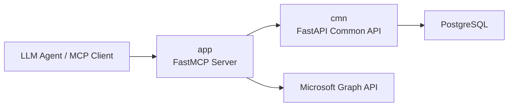
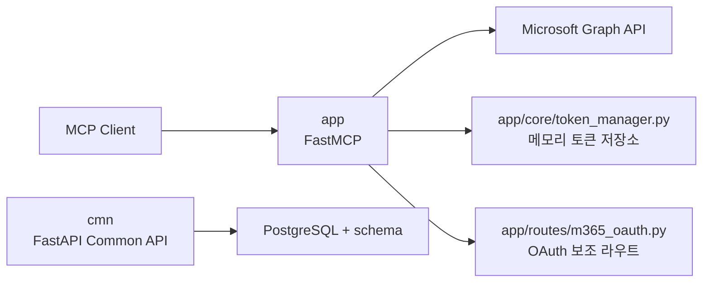
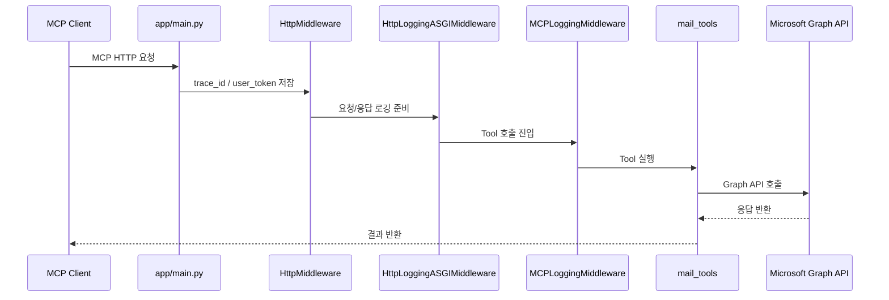
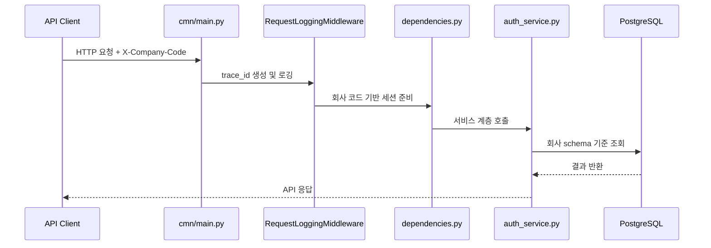

# mcp-mail

`mcp-mail`은 Microsoft 365 연동을 위한 모노레포입니다.  
현재 저장소는 두 개의 앱을 중심으로 구성됩니다.

- `app`: FastMCP 기반 MCP 서버
- `cmn`: FastAPI 기반 공통 API 서버

이 README는 "구상 중인 역할"과 "현재 코드 기준 상태"를 함께 적어, 설계와 구현 사이의 차이를 바로 이해할 수 있도록 정리했습니다.

## 역할 요약

| 영역 | 목표 역할 | 현재 코드 기준 상태 |
| :-- | :-- | :-- |
| `app` | LLM/에이전트가 호출하는 MCP 서버 | FastMCP 서버로 구성되어 있고, 현재는 메일 조회 중심으로 연결되어 있습니다. |
| `cmn` | 인증, 토큰, 로그, DB 세션 등 공통 기능을 제공하는 API 서버 | FastAPI 앱으로 분리되어 있으며, OAuth 콜백, 사용자 토큰 조회, 앱 토큰 발급, 로그 저장 API를 가지고 있습니다. |

## 현재 디렉터리 구조

```text
mcp-mail/
├─ app/                         # FastMCP 기반 MCP 서버
│  ├─ main.py                   # MCP 앱 조립 진입점
│  ├─ server.py                 # 최소 예제 FastMCP 서버
│  ├─ clients/                  # Graph/HTTP 클라이언트
│  ├─ common/                   # 공통 로거
│  ├─ core/                     # 설정, 토큰 매니저, 미들웨어
│  ├─ models/                   # UserInfo 등 모델
│  ├─ routes/                   # OAuth 보조 라우트
│  ├─ security/                 # JWT 검증 및 키 캐시
│  └─ tools/                    # MCP Tool 모음
├─ cmn/                         # FastAPI 기반 공통 API 서버
│  ├─ main.py                   # FastAPI 앱 조립 진입점
│  ├─ api/                      # 라우터, 엔드포인트
│  ├─ base/                     # 예외 처리, 로깅, 미들웨어
│  ├─ core/                     # 설정, DB, DI
│  ├─ db/                       # 모델, CRUD
│  ├─ repositories/             # DB 접근 계층
│  ├─ schemas/                  # 응답 스키마
│  ├─ services/                 # 서비스 계층
│  ├─ static/                   # Swagger 정적 리소스
│  └─ utils/                    # 토큰/유틸리티
├─ docs/                        # 각종 가이드 문서
├─ requirements.txt
└─ README.md
```

## 아키텍처

### 1. 목표 아키텍처



- `app`은 MCP 프로토콜 처리와 Tool 실행에 집중합니다.
- `cmn`은 인증, 토큰, 로그, 회사별 스키마 세션 같은 공통 기능을 맡습니다.
- 이렇게 분리하면 MCP 서버와 공통 API 서버의 책임이 섞이지 않습니다.
- 관련 코드 경로는 `app/main.py`, `cmn/main.py`, `cmn/core/database.py` 입니다.

### 2. 현재 코드 기준 상태



- `app` 쪽에는 아직 메모리 기반 토큰 매니저와 OAuth 보조 라우트가 남아 있습니다.
- `cmn` 쪽에는 DB 기반 인증/토큰/API 구성이 따로 존재합니다.
- 즉, 인증 관련 책임이 `app`과 `cmn`에 동시에 일부 존재하는 과도기 구조입니다.
- 관련 코드 경로는 `app/core/token_manager.py`, `app/routes/m365_oauth.py`, `cmn/api/endpoint/auth.py` 입니다.

## `app` 설명

`app`은 FastMCP 서버입니다.  
LLM 또는 MCP 클라이언트가 이 서버의 Tool을 호출하면, 서버가 Microsoft Graph API를 대신 호출해서 결과를 반환합니다.

### 주요 코드

| 파일 | 설명 |
| :-- | :-- |
| `app/main.py` | FastMCP 앱 생성, 미들웨어 등록, Tool 등록 |
| `app/tools/mail_tools.py` | 메일 관련 MCP Tool 정의 |
| `app/clients/graph_client.py` | Microsoft Graph API 호출 공통 래퍼 |
| `app/core/http_middleware.py` | `x-request-id`, `mcp_user_token` 처리 |
| `app/core/http_asgi_middleware.py` | MCP HTTP 요청/응답 로깅 |
| `app/core/mcp_midleware.py` | Tool 실행 로깅 및 사용자 컨텍스트 처리 |
| `app/security/jwt_auth.py` | JWT 해석 또는 개발용 사용자 매핑 |
| `app/core/token_manager.py` | 메모리 기반 OAuth state / access token 저장소 |

### 현재 활성화된 MCP 기능

- `register_mail_tools(mcp)`가 등록되어 있습니다.
- 실제 활성 Tool은 현재 `get_recent_emails` 중심입니다.
- Teams, SharePoint 등의 Tool 모듈은 존재하지만 `app/main.py`에서는 아직 등록이 주석 처리되어 있습니다.

### `app` 요청 흐름



- `HttpMiddleware`는 요청 헤더를 읽어 `request.state`에 값을 보관합니다.
- `MCPLoggingMiddleware`는 Tool 실행 전후를 기록합니다.
- `graph_client.py`는 실제 Graph API 호출을 감싸고 공통 예외를 정리합니다.
- 관련 코드 경로는 `app/core/http_middleware.py`, `app/core/http_asgi_middleware.py`, `app/core/mcp_midleware.py` 입니다.

## `cmn` 설명

`cmn`은 FastAPI 기반 공통 API 서버입니다.  
현재는 DB 연결, 회사별 스키마 처리, OAuth 콜백, 사용자 토큰 조회, 앱 토큰 발급, 로그 저장을 담당하는 구조로 정리되고 있습니다.

### 주요 코드

| 파일 | 설명 |
| :-- | :-- |
| `cmn/main.py` | FastAPI 앱 생성, lifespan, Swagger, 미들웨어 등록 |
| `cmn/api/routers.py` | 엔드포인트 라우터 등록 |
| `cmn/api/endpoint/auth.py` | 인증/OAuth 관련 API |
| `cmn/api/endpoint/logs.py` | MCP Tool 로그 저장 API |
| `cmn/core/database.py` | SQLAlchemy Async 엔진 및 schema session 제공 |
| `cmn/core/dependencies.py` | `X-Company-Code` 기반 DB 세션 DI |
| `cmn/services/auth_service.py` | 앱 토큰 발급 서비스 로직 |
| `cmn/base/middleware.py` | 요청/응답 로깅 미들웨어 |
| `cmn/base/exception.py` | 전역 예외 처리 핸들러 |

### `cmn` API 흐름



- `X-Company-Code` 헤더를 사용해 어떤 회사 스키마를 사용할지 결정합니다.
- `Database.get_session_schema()`가 schema별 `AsyncSession`을 제공합니다.
- 서비스 계층은 토큰 발급/조회 로직을 감싸고, 엔드포인트는 HTTP 입출력에 집중합니다.
- 관련 코드 경로는 `cmn/core/dependencies.py`, `cmn/core/database.py`, `cmn/services/auth_service.py` 입니다.

### 현재 제공 중인 엔드포인트

| 메서드 | 경로 | 설명 |
| :--: | :-- | :-- |
| `POST` | `/api/auth/` | 앱 권한 토큰 발급 요청 |
| `GET` | `/api/auth/m365/callback` | M365 OAuth 콜백 처리 |
| `GET` | `/api/auth/user/token` | 사용자 위임 토큰 조회 및 필요 시 갱신 |
| `POST` | `/api/logs/tool` | Tool 실행 로그 저장 |
| `POST` | `/api/logs/graph` | Graph 로그용 placeholder API |
| `POST` | `/health` | 서버 상태 확인 |

## 현재 구현에서 보이는 포인트

### 장점

- `app`과 `cmn`이 디렉터리 레벨에서 이미 분리되어 있어 책임 분리 방향이 분명합니다.
- `cmn`은 서비스, 저장소, DI, DB 모델이 나뉘어 있어 공통 API 서버로 확장하기 좋은 구조입니다.
- `app`은 미들웨어, 보안, Tool, 클라이언트가 나뉘어 있어 MCP 서버 확장에 유리합니다.

### 정리 필요 포인트

- 인증/토큰 책임이 현재 `app`과 `cmn`에 함께 존재합니다.
- `app`은 메모리 기반 토큰 매니저를 사용하고, `cmn`은 DB 기반 토큰 관리를 향하고 있습니다.
- 따라서 앞으로는 `app`은 MCP 실행에 집중하고, 인증/토큰/로그 공통 처리는 `cmn`으로 모으는 방향이 자연스럽습니다.

이렇게 한 이유는 현재 저장소가 "완성된 분리 구조"라기보다 "분리 중인 구조"이기 때문입니다.  
README에서 이 차이를 분명히 적어 두면, 이후 리팩토링할 때도 문서가 거짓말하지 않습니다.

대안으로는 README를 목표 구조만 중심으로 단순하게 쓰는 방법도 있습니다.  
다만 그 경우 지금 코드를 처음 보는 사람이 실제 구현과 문서를 맞춰보며 혼란을 겪을 수 있다는 트레이드오프가 있습니다.

## 실행 방법

### 1. 의존성 설치

```bash
python -m pip install -r requirements.txt
```

전제조건:
- Python 3.11 이상 권장
- `.venv` 가상환경이 준비되어 있어야 합니다.
- `.env` 파일 필요

기대 결과:
- FastAPI, FastMCP, SQLAlchemy, httpx 등 필수 패키지가 설치됩니다.

실패 예시:
- `ModuleNotFoundError` 또는 빌드 오류가 발생하면 가상환경이 활성화되지 않았을 수 있습니다.
- Windows Git Bash 또는 보안 정책 환경에서는 `bash: .../.venv/Scripts/pip: Permission denied`가 발생할 수 있습니다.

해결 방법:
- PowerShell: `.\.venv\Scripts\Activate.ps1` 실행 후 `python -m pip install -r requirements.txt`를 다시 실행합니다.
- Git Bash: `source .venv/Scripts/activate` 후에도 `pip` 대신 `python -m pip install -r requirements.txt`를 사용합니다.
- 자세한 원인과 우회 방법은 `docs/WINDOWS_PIP_PERMISSION_GUIDE.md`를 참고합니다.

### 2. `cmn` 서버 실행

```bash
uvicorn cmn.main:app --host 0.0.0.0 --port 8001
```

전제조건:
- `DATABASE_URL`, `COMPANY_CODES` 등이 `.env`에 설정되어 있어야 합니다.

기대 결과:
- `http://localhost:8001/docs` 또는 환경별 `root_path` 기준 Swagger UI에 접속할 수 있습니다.

### 3. `app` 서버 실행

```bash
uvicorn app.main:app --host 0.0.0.0 --port 8002
```

전제조건:
- `MS365_CONFIGS`, `AUTH_JWT_USER_TOKEN`, `LOG_LEVEL` 등이 `.env`에 있어야 합니다.

기대 결과:
- MCP HTTP 엔드포인트가 `/mcp` 경로에 열립니다.

### 4. MCP Inspector 연결

```bash
npx @modelcontextprotocol/inspector
```

설정값:
- Transport Type: `streamable-http`
- URL: `http://127.0.0.1:8002/mcp`

## 환경 변수

### `app` 주요 환경 변수

| 변수명 | 설명 |
| :-- | :-- |
| `LOG_LEVEL` | 로그 레벨 |
| `ENV` | 실행 환경 |
| `AUTH_JWT_USER_TOKEN` | JWT 검증 사용 여부 |
| `MS365_CONFIGS` | 회사별 M365 설정 JSON |
| `GRAFANA_ENDPOINT` | Grafana OTLP endpoint |

### `cmn` 주요 환경 변수

| 변수명 | 설명 |
| :-- | :-- |
| `DATABASE_URL` | PostgreSQL Async 연결 문자열 |
| `COMPANY_CODES` | 허용할 회사 코드 목록 |
| `ENV` | 실행 환경 |

## 관련 문서

- `GUIDE.md`
- `PROJECT.md`
- `GRAPH_LOGGING_GUIDE.md`
- `docs/CMN_DEPENDENCY_INJECTION_GUIDE.md`
- `docs/EXCEPTION_HANDLING_GUIDE.md`
- `docs/HTTP_LOGGING_GUIDE.md`
- `docs/SQLALCHEMY_ENGINE_GUIDE.md`

## 한 줄 정리

현재 이 저장소는 `app = FastMCP 서버`, `cmn = FastAPI 공통 API 서버`로 역할을 나누는 방향으로 정리되고 있으며,  
실제 코드도 그 방향을 따라가고 있지만 인증/토큰 책임은 아직 과도기적으로 일부 중복되어 있습니다.
