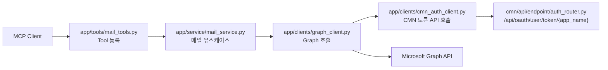
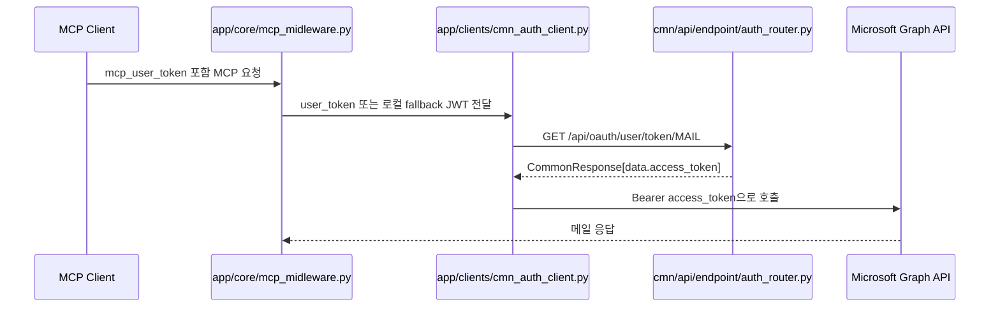

# APP_FASTMCP_REFACTOR_GUIDE.md

## 목적

이 문서는 `app/` FastMCP 서버를 리팩토링하면서 바뀐 책임 경계를 설명합니다.  
핵심 목표는 `app`이 더 이상 OAuth 시작/콜백/토큰 저장을 직접 처리하지 않고, `cmn`의 공통 인증 API를 호출하는 구조로 정리하는 것입니다.

## 변경 요약

- `app/clients/graph_client.py`는 더 이상 삭제된 `app/core/token_manager.py`를 참조하지 않습니다.
- 사용자 위임 토큰은 `app/clients/cmn_auth_client.py`를 통해 `cmn`의 `/api/oauth/user/token/{app_name}` API에서 받아옵니다.
- 메일 조회 유스케이스는 `app/service/mail_service.py`로 내려서 `tool -> service -> client` 경계를 분리했습니다.
- `app/tools/mail_tools.py`는 MCP Tool 등록과 파라미터 계약만 담당합니다.

## 리팩토링 후 구조



- `Tool`은 MCP 계약과 설명 문구만 담당합니다.
- `Service`는 날짜 필터 조합, 응답 평탄화처럼 유스케이스 로직을 담당합니다.
- `GraphClient`는 Graph 호출에 집중하고, access token은 `CmnAuth`에 위임합니다.
- 이 구조 덕분에 인증 책임은 `cmn`, 실행 책임은 `app`으로 분리됩니다.
- 관련 코드 경로는 `app/tools/mail_tools.py`, `app/service/mail_service.py`, `app/clients/graph_client.py`, `app/clients/cmn_auth_client.py` 입니다.

## 토큰 흐름



- 운영 환경에서는 원 요청의 `mcp_user_token`을 그대로 `Authorization: Bearer ...`로 전달합니다.
- 로컬 학습 환경에서는 실제 SSO 토큰이 없을 수 있으므로, `current_user`로 임시 JWT를 생성해 같은 계약을 유지합니다.
- 이렇게 한 이유는 개발 편의성은 유지하면서도 토큰 저장 책임을 `app`에 다시 넣지 않기 위해서입니다.
- 대안으로는 로컬에서도 반드시 실토큰을 요구하는 방법이 있습니다.
- 그 대안의 트레이드오프는 운영 계약은 더 엄격해지지만, 로컬 실습과 디버깅 진입 장벽이 커진다는 점입니다.

## 주요 설정

아래 환경변수는 `app/core/config.py`에서 읽습니다.

| 이름 | 설명 |
| :-- | :-- |
| `CMN_API_BASE_URL` | `cmn` 공통 API 기본 주소 |
| `CMN_API_TIMEOUT_SECONDS` | `cmn` 내부 API 호출 타임아웃 |
| `M365_USER_TOKEN_APP_NAME` | 사용자 위임 토큰을 요청할 앱 이름 |
| `JWT_SECRET_KEY` | 로컬 fallback JWT 생성 시 사용하는 공통 서명 키 |
| `JWT_ALGORITHM` | 로컬 fallback JWT 서명 알고리즘 |

## 실행 예시

```bash
uvicorn cmn.main:app --host 127.0.0.1 --port 8001
uvicorn app.main:app --host 127.0.0.1 --port 8002
```

전제조건:
- `cmn` 서버가 먼저 떠 있어야 합니다.
- `.env`에 `CMN_API_BASE_URL=http://127.0.0.1:8001` 같은 값이 맞게 들어 있어야 합니다.
- 로컬 학습 모드라면 `JWT_SECRET_KEY`, `JWT_ALGORITHM` 값이 `cmn`과 동일해야 합니다.

기대 결과:
- `python -c "import app.main"` 또는 `uvicorn app.main:app ...`가 더 이상 `token_manager` 누락으로 실패하지 않습니다.
- 메일 Tool 호출 시 access token은 `cmn`을 통해 조회됩니다.

실패 예시:
- `CMN_DELEGATED_TOKEN_REQUIRED`가 오면 사용자의 Microsoft 365 위임 권한 동의가 아직 없다는 뜻입니다.

해결 방법:
- 먼저 `cmn` 쪽 delegated OAuth 동의 흐름을 완료한 뒤 다시 Tool을 호출합니다.
