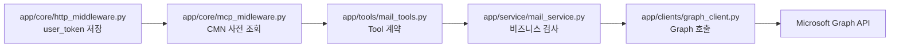

# APP_MCP_TOOL_CONTEXT_GUIDE

## 목적

`app/` FastMCP 서버에서 tool 호출이 들어왔을 때 사용자 컨텍스트를 준비하고 Graph API 를 호출하는 흐름을 설명합니다.
이번 구조의 핵심은 `app` 이 JWT 를 직접 해석하지 않고, `cmn` 에 사용자 토큰을 전달해 사용자 정보와 Graph access token 을 받아온다는 점입니다.

## 호출 흐름



- `http_middleware.py` 는 요청 헤더의 `mcp_user_token` 을 `request.state.user_token` 에 저장합니다.
- `mcp_midleware.py` 는 tool 실행 전에 CMN 을 호출하고 `request.state.current_user`, `request.state.graph_access_token`, `request.state.blacklist` 를 채웁니다.
- `mail_service.py` 는 저장된 사용자 정보와 blacklist 를 기준으로 비즈니스 검사를 수행합니다.
- `graph_client.py` 는 service 가 넘긴 `access_token` 으로 Graph HTTP 요청만 수행합니다.
- 관련 코드 경로는 `app/core/mcp_midleware.py`, `app/clients/cmn_auth_client.py`, `app/service/mail_service.py`, `app/clients/graph_client.py` 입니다.

## 설계 기준

요청별 값은 `request.app.state` 가 아니라 `request.state` 에 저장합니다.
`request.app.state` 는 앱 전체 전역 상태라 동시 사용자 요청에서 값이 섞일 수 있고, `request.state` 는 현재 HTTP/MCP 요청 단위로 격리됩니다.

`graph_client.py` 는 토큰 발급, 사용자 조회, blacklist 판단을 하지 않습니다.
이런 판단은 tool 실행 전 middleware 와 service 계층의 책임입니다.

## 예시

전제조건:
- `cmn` 서버가 먼저 실행되어 있어야 합니다.
- `.env` 의 `CMN_API_BASE_URL` 이 실행 중인 `cmn` 주소와 같아야 합니다.
- MCP 요청 헤더에 `mcp_user_token` 이 포함되어야 합니다.

실행 예시:

```bash
uvicorn cmn.main:app --host 127.0.0.1 --port 8001
uvicorn app.main:app --host 127.0.0.1 --port 8002
```

기대 결과:
- `get_recent_emails` tool 호출 전에 CMN 에서 Graph access token 을 받아옵니다.
- service 계층은 해당 token 을 `graph_request(access_token=...)` 로 명시적으로 전달합니다.

실패 예시:
- `mcp_user_token` 이 없으면 `CMN_AUTHORIZATION_MISSING` 응답이 반환됩니다.

해결 방법:
- MCP client 가 `/mcp` 요청에 `mcp_user_token` 헤더를 포함하도록 설정합니다.

## 남은 적용 지점

현재 `app/main.py` 에 등록된 메일 도구는 새 흐름을 따릅니다.
다만 `app/tools/sharepoint_tools.py` 를 다시 등록하려면, 해당 tool 도 service 계층을 만들고 `graph_request(access_token=...)` 를 명시적으로 넘기는 방식으로 맞춰야 합니다.
