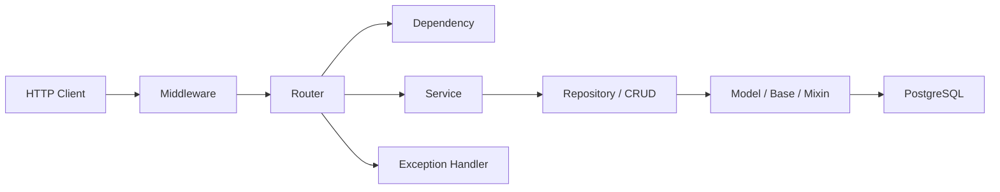

# CMN_ENTERPRISE_GUIDE.md

## 목적

`cmn` 앱에 반영한 엔터프라이즈 스타일 설계 의도를 정리합니다. 이 문서는 현재 구현이 왜 `router -> dependency -> service -> repository/crud -> model` 흐름을 지향하는지 설명합니다.

## 핵심 구조

코드 경로:
- `cmn/api/routers.py`
- `cmn/core/dependencies.py`
- `cmn/services/auth_service.py`
- `cmn/repositories/auth_repository.py`
- `cmn/db/models/base.py`
- `cmn/db/models/mcp_log.py`
- `cmn/base/middleware.py`
- `cmn/base/exception.py`

설명:
- Router는 HTTP 계약과 스키마 변환에 집중합니다.
- Dependency는 인증 정보 해석, 테넌트 스키마 결정, 세션 주입처럼 요청 문맥을 다룹니다.
- Service는 유스케이스를 조합하고, Repository/CRUD는 DB 조회와 저장 접근을 분리합니다.
- Middleware와 Exception Handler는 비즈니스 코드 밖에서 횡단 관심사를 처리합니다.

## 지금 코드에서 보이는 패턴

1. 얇은 Router
- `cmn/api/endpoint/logs_router.py`는 요청 스키마를 받고 모델 생성/저장 호출만 수행합니다.
- 왜 이렇게 했는지: HTTP 입출력과 비즈니스 로직을 섞지 않으려는 의도입니다.
- 대안: 라우터에서 직접 DB 쿼리까지 수행할 수 있습니다.
- 트레이드오프: 초기 구현은 빠르지만 규모가 커지면 테스트와 책임 분리가 어려워집니다.

2. 요청 문맥용 Dependency
- `cmn/core/dependencies.py`는 Bearer JWT 또는 `X-Company-Code`로 회사 스키마를 결정하고 세션을 공급합니다.
- 왜 이렇게 했는지: 인증/세션 경계를 라우터마다 중복하지 않기 위해서입니다.
- 대안: 각 라우터에서 직접 세션과 헤더를 처리할 수 있습니다.
- 트레이드오프: 단순해 보이지만 라우터가 늘수록 중복과 실수가 커집니다.

3. Service 계층
- `cmn/services/auth_service.py`는 앱 권한 토큰 발급 유스케이스를 감쌉니다.
- 왜 이렇게 했는지: 토큰 캐시, 설정 조회, 외부 API 호출을 엔드포인트 밖으로 분리하기 위해서입니다.
- 대안: 라우터에서 바로 처리할 수 있습니다.
- 트레이드오프: 파일 수는 줄지만 업무 규칙이 HTTP 코드에 묶입니다.

4. 공통 Base / Mixin / 추상 모델
- `cmn/db/models/base.py`의 `AuditMixin`, `cmn/db/models/mcp_log.py`의 `LogBase`로 공통 컬럼을 재사용합니다.
- 왜 이렇게 했는지: 감사 컬럼과 로그 공통 필드를 중복 없이 유지하기 위해서입니다.
- 대안: 각 모델에 컬럼을 반복 선언할 수 있습니다.
- 트레이드오프: 선언은 명시적이지만 테이블이 늘수록 누락과 불일치 위험이 커집니다.

5. 횡단 관심사 분리
- `cmn/base/middleware.py`는 trace_id와 요청/응답 로깅을, `cmn/base/exception.py`는 공통 오류 응답을 담당합니다.
- 왜 이렇게 했는지: 모든 엔드포인트에 공통으로 필요한 관심사를 비즈니스 코드 밖으로 빼기 위해서입니다.
- 대안: 각 엔드포인트에서 직접 로깅과 예외 응답을 처리할 수 있습니다.
- 트레이드오프: 단건 처리에는 단순하지만 전체 일관성이 깨집니다.

## 현재 단계의 해석

`cmn`은 완전히 고정된 최종 아키텍처라기보다, 공통 API 서버를 엔터프라이즈스럽게 키우기 위한 골격을 먼저 잡은 상태입니다. 그래서 일부 영역은 CRUD와 Service가 공존하고, 일부 로그 저장은 얇은 Active Record 스타일을 남겨 두고 있습니다.

그럼에도 전체 방향은 분명합니다.
- Router는 얇게 유지한다.
- 인증/세션/테넌트 문맥은 Dependency에서 정리한다.
- 유스케이스는 Service로 모은다.
- 공통 컬럼과 로그 공통 구조는 Base/Mixin/추상 모델로 재사용한다.
- 로깅과 예외는 Middleware/Exception Handler로 분리한다.

## 실행 관점 예시

전제조건:
- `DATABASE_URL`, `COMPANY_CODES`, `JWT_SECRET_KEY`, `JWT_ALGORITHM`가 `.env`에 설정되어 있어야 합니다.
- `cmn.main:app`이 정상 구동 중이어야 합니다.

기대 결과:
- `/api/oauth/*`, `/api/logs/*`, `/utils/jwt/*` 요청이 공통 미들웨어와 예외 처리기를 거쳐 일관된 방식으로 처리됩니다.

실패 예시:
- JWT가 없거나 유효하지 않으면 dependency 단계에서 인증 사용자 복원에 실패합니다.
- DB 스키마 코드가 잘못되면 dependency 또는 database 계층에서 세션 준비에 실패합니다.

해결 방법:
- 인증 흐름은 `cmn/utils/jwt_manager.py`와 `cmn/core/dependencies.py`를 함께 확인합니다.
- 세션/스키마 흐름은 `cmn/core/database.py`와 `cmn/core/dependencies.py`를 같이 추적합니다.
