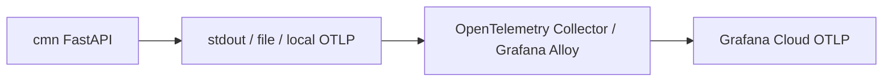

# COLLECTOR_ALLOY_GUIDE

## 개요

이 문서는 실제 배포 서버에서 사용할 운영형 관측성 패턴으로, `Collector / Alloy`를 중간에 두는 구조를 설명합니다.

관련 코드 경로:
- `cmn/base/logger.py`
- `cmn/base/opentelemetry.py`
- `cmn/core/config.py`

## 운영 권장 구조



- 앱은 표준 `logging`에 집중합니다.
- Collector/Alloy가 인증, 재시도, batch, 라우팅, 마스킹을 담당합니다.
- 실제 운영에서는 이 구조가 앱 direct export보다 더 안정적입니다.

## 왜 운영형으로 더 좋은가

- 앱이 Grafana endpoint와 인증 헤더를 직접 몰라도 됩니다.
- 인증 토큰 교체를 앱 재배포 없이 Collector 설정 변경으로 처리하기 쉽습니다.
- 전송 실패, batch, 재시도, 라우팅을 Collector가 맡습니다.
- 나중에 Grafana가 아닌 다른 backend로 바꿔도 앱 수정 범위가 줄어듭니다.

## 권장 배포 패턴

### 1. Agent / Sidecar 패턴

- 앱 옆에 Collector/Alloy를 함께 둡니다.
- 앱은 `localhost:4318` 같은 로컬 OTLP receiver로 보냅니다.

### 2. Gateway 패턴

- 여러 앱이 공용 Collector endpoint로 보냅니다.
- 팀/클러스터 단위 확장에 유리합니다.

## 최소 collector 예시

```yaml
receivers:
  otlp:
    protocols:
      http:
      grpc:

processors:
  batch:
    timeout: 1s
    send_batch_size: 512

exporters:
  otlphttp/grafana_logs:
    endpoint: https://otlp-gateway-prod-ap-northeast-0.grafana.net/otlp/v1/logs
    headers:
      Authorization: "Bearer ${GRAFANA_BEARER_TOKEN}"

service:
  pipelines:
    logs:
      receivers: [otlp]
      processors: [batch]
      exporters: [otlphttp/grafana_logs]
```

전제조건:
- Collector/Alloy가 서버에서 실행 중이어야 합니다.
- `GRAFANA_BEARER_TOKEN` 환경변수가 Collector 런타임에 주입돼 있어야 합니다.

기대 결과:
- 앱은 local OTLP receiver로 로그를 보내고,
- Collector가 Grafana Cloud로 안전하게 forward 합니다.

실패 예시:
- 앱이 직접 Grafana로 보내는 Direct 설정을 그대로 둔 채 Collector도 함께 붙여 중복 전송되는 경우

해결 방법:
- 운영 서버에서는 `ENABLE_OTEL_DIRECT=false`
- 앱은 local receiver만 보도록 설정 정책을 분리합니다.

## 앱 설정 방향

운영 서버에서는 보통 두 선택지 중 하나를 택합니다.

### A. 앱은 표준 logging만 유지

- stdout / 파일 로그를 Collector가 읽음
- 앱 OTLP direct export는 끔

### B. 앱은 local Collector로만 OTLP push

```env
ENABLE_OTEL_DIRECT=true
OTEL_EXPORTER_OTLP_LOGS_ENDPOINT=http://127.0.0.1:4318/v1/logs
OTEL_EXPORTER_OTLP_AUTH_TOKEN=
```

왜 이렇게 했는지:
- endpoint는 local collector를 보게 하고
- 최종 backend 인증은 collector가 전담하게 만들어 역할을 분리합니다.

## 운영 체크리스트

- 운영 서버에서 `ENABLE_OTEL_DIRECT`를 켤지 끌지 정책이 정해져 있는가?
- 앱이 backend 직접 endpoint를 보지 않고 local collector를 보게 할 수 있는가?
- Collector/Alloy 설정에서 batch, retry, auth 정책이 있는가?
- 장애 시 collector 로그와 앱 로그를 분리해서 볼 수 있는가?

## 한 줄 정리

Collector / Alloy 방식은 실제 배포 서버에서 쓰는 운영 표준 구조로 보고, 앱은 관측성 backend보다 local collector와 더 가깝게 붙이는 것이 좋습니다.
