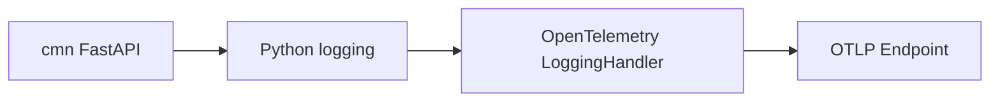

# DIRECT_OTLP_GUIDE

## 개요

이 문서는 `cmn/base/opentelemetry.py` 기준으로, Python/FastAPI 앱이 OTLP endpoint로 로그를 직접 전송하는 Direct 방식 템플릿 가이드입니다.

관련 코드 경로:
- `cmn/base/opentelemetry.py`
- `cmn/base/logger.py`
- `cmn/core/config.py`
- `cmn/main.py`

## 언제 쓰는가

- 로컬 개발에서 빠르게 OTLP 연동을 검증할 때
- Collector/Alloy를 아직 도입하지 않은 초기 단계
- 단일 서비스에서 관측성 연동을 먼저 확인할 때

## 구조



- 앱이 OTLP endpoint를 직접 알고 있습니다.
- 인증 헤더도 앱 설정이 직접 가지고 있습니다.
- 설정이 단순해서 빠르게 검증하기 좋지만, 운영 표준으로는 Collector 방식보다 결합도가 높습니다.

## 필수 설정

```env
ENABLE_OTEL_DIRECT=true
OTEL_SERVICE_NAME=mcp-cmn
OTEL_SERVICE_VERSION=1.0.0
GRAFANA_ENDPOINT=https://otlp-gateway-prod-ap-northeast-0.grafana.net/otlp/v1/logs
GRAFANA_INSTANCE_ID=...
GRAFANA_API_TOKEN=YOUR_TOKEN
```

전제조건:
- OTLP endpoint가 실제로 열려 있어야 합니다.
- 토큰 또는 인증 헤더 값이 유효해야 합니다.

기대 결과:
- `logger.info(...)`로 남긴 로그가 콘솔/파일과 함께 OTLP endpoint로도 전송됩니다.

실패 예시:
- endpoint는 맞지만 `Authorization` 헤더가 없어서 `401/403`이 나는 경우

해결 방법:
- `GRAFANA_ENDPOINT`
- `GRAFANA_API_TOKEN`
를 정확히 채웁니다.

## 현재 템플릿의 특징

- `setup_opentelemetry()`는 앱 시작 시 1회만 실행됩니다.
- `shutdown_opentelemetry()`는 종료 시 batch 버퍼를 flush 후 종료합니다.
- `ENABLE_OTEL_DIRECT=false`면 기능이 비활성화됩니다.
- Direct 템플릿은 기존 `GRAFANA_*` 환경변수를 그대로 사용합니다.

## 왜 이렇게 구성했는가

- Direct 방식은 가장 빠르게 붙는 구조입니다.
- 로컬 debug나 PoC에서는 중간 Collector 없이 endpoint만 검증할 수 있습니다.
- 반면 운영에서는 앱이 인증/전송 정책까지 직접 알게 되어 결합도가 올라갑니다.

대안 1개:
- Collector/Alloy를 중간에 두고 앱은 표준 logging만 유지

트레이드오프 1개:
- 운영 구조는 더 좋지만, 로컬에서 처음 붙일 때는 Direct보다 설정이 많습니다.

## 체크리스트

- `ENABLE_OTEL_DIRECT` 플래그가 있는가?
- 앱 시작 시 1회 초기화되는가?
- 앱 종료 시 `force_flush()` / `shutdown()`을 호출하는가?
- handler 중복 추가를 막고 있는가?
- `GRAFANA_*` 환경변수를 그대로 사용하고 있는가?

## 한 줄 정리

Direct OTLP는 "빠르게 붙여보는 개발용 기본 템플릿"으로 좋고, 운영 표준으로는 Collector/Alloy 방식 이전 단계로 보면 됩니다.
