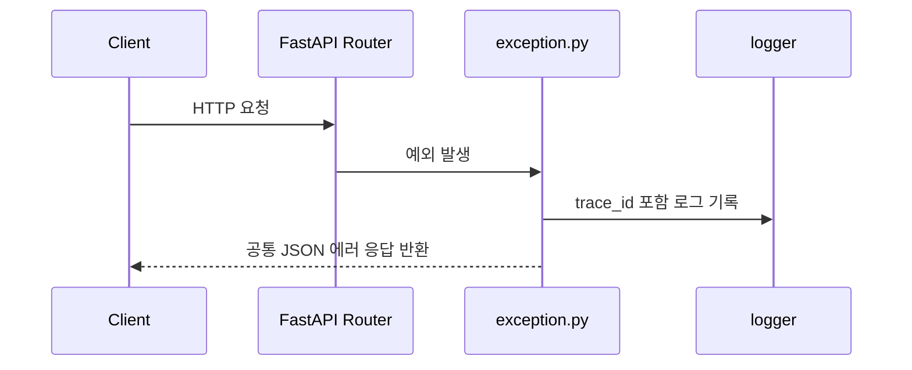

# EXCEPTION_ENTERPRISE_GUIDE

## 개요

이 문서는 `cmn/base/exception.py`를 기준으로, FastAPI 서비스에서 예외 처리 모듈이 엔터프라이즈 패턴 관점에서 어떤 역할을 해야 하는지 정리한 학습 노트입니다.

관련 코드 경로:
- `cmn/base/exception.py`
- `cmn/main.py`

## 이 모듈의 지향점

- 예외 응답 포맷을 한 곳에서 통일한다.
- 예외 종류에 따라 HTTP 상태코드와 메시지 정책을 명확히 분리한다.
- 운영 중 장애를 추적할 수 있도록 `trace_id`를 응답과 로그에 연결한다.
- 라우터/서비스가 예외 응답 포맷을 매번 직접 만들지 않게 한다.

## 예외 처리 흐름



- 요청 처리 중 예외가 발생하면 FastAPI는 등록된 예외 핸들러를 찾습니다.
- 예외 핸들러는 "예외를 어떤 HTTP 응답으로 바꿀지"를 결정합니다.
- 이때 `trace_id`를 로그와 응답에 함께 넣어야 운영 추적이 쉬워집니다.
- 관련 코드는 `cmn/base/exception.py`, `cmn/base/middleware.py`에 연결됩니다.

## 예외를 나누는 기준

### 1. `Exception`

- 예상하지 못한 최상위 오류입니다.
- 보통 `500 Internal Server Error`로 응답합니다.
- 사용자에게는 일반화된 메시지를 주고, 로그에는 traceback을 남깁니다.

### 2. `HTTPException`

- FastAPI가 이해하는 명시적 HTTP 예외입니다.
- 라우터나 의존성 계층에서 자주 사용합니다.
- `detail`은 문자열일 수도 있고 `dict`, `list`일 수도 있으므로 `message`와 `detail`의 역할을 분리하는 것이 좋습니다.

### 3. `RequestValidationError`

- 요청 바디, query, path, header 검증 실패입니다.
- 보통 "클라이언트가 잘못 보낸 값"으로 보고 `400` 계열로 응답합니다.

### 4. `ValidationError`

- Pydantic 모델을 서비스 내부에서 직접 만들거나 변환할 때 발생할 수 있습니다.
- 요청 오류가 아니라 내부 데이터 조립 실패일 수 있으므로 `500`으로 보는 팀도 많습니다.

왜 이렇게 나누는지:
- 누가 잘못했는지, 어디서 발생했는지를 구분해야 응답 정책과 로그 정책이 명확해집니다.

대안 1개:
- `RequestValidationError`와 `ValidationError`를 같은 `400`으로 묶을 수 있습니다.

트레이드오프 1개:
- 구현은 단순해지지만, 내부 버그까지 사용자 입력 오류처럼 보일 수 있습니다.

## 엔터프라이즈 패턴에서 중요한 포인트

### 1. 중앙 등록

`main.py`에서 예외 핸들러를 한 번만 등록하고, 실제 등록 로직은 `exception.py`에 둡니다.

```python
from cmn.base.exception import register_exception_handler

register_exception_handler(app)
```

문법 설명:
- 함수로 등록 로직을 분리하면 앱 조립 코드가 단순해집니다.
- 등록 지점이 한 곳이라 유지보수가 쉽습니다.

### 2. 공통 응답 포맷

엔터프라이즈 서비스에서는 에러 응답 형식을 통일하는 경우가 많습니다.

```json
{
  "success": false,
  "error_code": 400,
  "message": "요청의 입력값 또는 형식이 잘못되었습니다.",
  "trace_id": "..."
}
```

### 3. `message`와 `detail`의 역할 분리

- `message`: 사용자나 프론트가 기본 문구로 쓰기 좋은 문자열
- `detail`: 디버깅 또는 세부 정보

왜 이렇게 했는지:
- `message`가 항상 문자열이면 프론트가 일관되게 사용할 수 있습니다.
- `detail`은 필요할 때만 활용하면 됩니다.

### 4. 로그와 응답을 연결하는 `trace_id`

- 로그에만 있으면 클라이언트가 전달하기 어렵습니다.
- 응답에만 있으면 서버 로그 검색이 어려울 수 있습니다.
- 그래서 둘 다 넣는 것이 운영에 유리합니다.

## 현재 프로젝트에서 배운 점

- `Exception`, `HTTPException`, `RequestValidationError`, `ValidationError`를 분리하면 책임이 선명해집니다.
- `HTTPException.detail`은 타입이 고정되지 않기 때문에 `message`를 문자열로 정규화하는 설계가 유용합니다.
- `trace_id`를 응답에 넣으면 프론트, QA, 운영자가 같은 키로 대화할 수 있습니다.
- 나중에 `AppException`, `InfraException` 같은 도메인 예외 계층을 추가해도 현재 구조 위에서 자연스럽게 확장할 수 있습니다.

## 안티패턴

- 라우터마다 `try/except`를 반복하며 직접 `JSONResponse`를 만드는 것
- 최상위 예외인데 내부 구현 정보까지 그대로 응답에 노출하는 것
- `RequestValidationError`와 `ValidationError`를 구분하지 않고 무조건 같은 메시지로 내려보내는 것
- `trace_id` 없이 로그만 남기거나, 반대로 응답만 남기는 것

## 체크리스트

- 예외 핸들러는 `main.py`에서 한 번만 등록하는가?
- 예외 종류별로 상태코드와 메시지 정책이 분리되어 있는가?
- `trace_id`가 로그와 응답에 연결되는가?
- `message`는 문자열로 안정적으로 유지되는가?
- 상세 정보(`detail`)는 운영 환경에서 과노출되지 않도록 검토했는가?

## 복붙 예시

전제조건:
- FastAPI 앱에서 공통 예외 핸들러를 사용하고 있어야 합니다.

예시:

```python
from fastapi import HTTPException

def raise_bad_request():
    raise HTTPException(
        status_code=400,
        detail={"code": "AUTH_001", "reason": "invalid token"},
    )
```

기대 결과:
- 응답의 `message`는 일반 문자열로 유지하고,
- `detail`에는 원본 구조를 담을 수 있습니다.

실패 예시:
- `message`에도 `dict`를 그대로 넣어 프론트 코드가 타입 분기 처리를 해야 하는 경우

해결 방법:
- `detail = exc.detail`
- `message = detail if isinstance(detail, str) else "요청 처리에 실패했습니다."`

## 다음 단계

- `AppException`, `InfraException` 추가
- 에러 코드 체계 표준화
- 운영 환경에서는 `detail` 노출 정책 세분화
