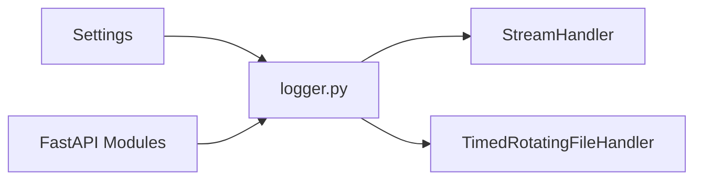

# LOGGER_ENTERPRISE_GUIDE

## 개요

이 문서는 `cmn/base/logger.py`를 기준으로, FastAPI 서비스에서 공통 로거 모듈이 엔터프라이즈 패턴에서 어떤 방향을 가져야 하는지 정리한 학습 노트입니다.

관련 코드 경로:
- `cmn/base/logger.py`
- `cmn/core/config.py`

## 이 모듈의 지향점

- 앱 전체가 같은 로깅 정책을 공유하게 한다.
- 콘솔 로그와 파일 로그를 일관되게 관리한다.
- 설정값을 환경별로 바꿀 수 있게 한다.
- 나중에 OTLP, Grafana 같은 관측성 시스템으로 확장하기 쉬운 구조를 만든다.

## 로거 구성 흐름



- `Settings`에서 로그 레벨과 파일 경로를 읽습니다.
- `logger.py`는 공통 로거를 한 번 생성하고 재사용합니다.
- 콘솔과 파일 핸들러를 함께 구성하면 로컬 디버깅과 운영 로그 보관을 동시에 챙길 수 있습니다.
- 관련 코드는 `cmn/base/logger.py`, `cmn/core/config.py`입니다.

## 엔터프라이즈 패턴에서 로거가 맡는 책임

### 1. 중앙화된 초기화

로거는 앱 전체에서 같은 형식으로 찍혀야 합니다.

```python
logger = get_logger(name="mcp-cmn", level=LOG_LEVEL, log_file_path=LOG_FILE_PATH)
```

문법 설명:
- `logging.getLogger(name)`은 같은 이름이면 같은 로거 객체를 다시 돌려줍니다.
- 그래서 import 시점 싱글톤처럼 한 번 생성하고 계속 재사용하는 패턴이 가능합니다.

### 2. 중복 핸들러 방지

```python
if logger.handlers:
    return logger
```

왜 이렇게 했는지:
- 핸들러가 중복으로 붙으면 로그가 2번, 3번씩 출력됩니다.
- 앱이 재로딩되거나 모듈이 여러 번 import되는 상황을 방어하기 좋습니다.

### 3. 운영 친화적인 보관 정책

`TimedRotatingFileHandler`는 시간 기준 회전을 지원합니다.

- `when="midnight"`: 자정 기준 회전
- `interval=10`: 10일마다 회전
- `backupCount=6`: 백업 로그 6개 유지

왜 이렇게 했는지:
- 로그 파일이 무한히 커지지 않게 하려는 목적입니다.
- 운영 중 디스크 사용량을 예측하기 쉬워집니다.

### 4. 전파 차단

```python
logger.propagate = False
```

왜 이렇게 했는지:
- 상위(root) 로거로 다시 전달되면 콘솔에 같은 로그가 중복 출력될 수 있습니다.
- 앱 전용 로거를 독립적으로 운영하기 쉬워집니다.

## 현재 프로젝트에서 배운 점

- 이 서비스는 Pod 생명주기 중 로그 레벨을 동적으로 바꿀 일이 거의 없어서, import 시점 싱글톤 방식이 단순하고 안전합니다.
- `LOG_LEVEL`, `LOG_FILE_PATH`를 `Settings`에 명시하면 설정 스키마가 더 분명해집니다.
- `backupCount`를 넣으면 파일 로그 무한 증가 위험을 줄일 수 있습니다.
- 표준 `logging` 기반 구조는 나중에 OTLP, Grafana 같은 관측성 도구로 확장하기에 유리합니다.

## 안티패턴

- 로거를 매 요청마다 새로 만드는 것
- 핸들러 중복 방지를 하지 않는 것
- 기본 로그 경로를 환경과 무관한 하드코딩 절대 경로로 두는 것
- `propagate=True` 상태에서 상위 로거까지 함께 구성해 중복 로그를 만드는 것

## 체크리스트

- 앱 전체에서 같은 공통 로거를 재사용하는가?
- 핸들러 중복 방지가 되어 있는가?
- `LOG_LEVEL`, `LOG_FILE_PATH`가 설정으로 분리되어 있는가?
- 파일 보관 정책(`interval`, `backupCount`)이 명시되어 있는가?
- `propagate = False` 여부를 검토했는가?

## 복붙 예시

전제조건:
- `Settings`에 `LOG_LEVEL`, `LOG_FILE_PATH`가 정의되어 있어야 합니다.

예시:

```python
file_handler = TimedRotatingFileHandler(
    log_file_path,
    when="midnight",
    interval=10,
    backupCount=6,
    encoding="utf-8",
)
```

기대 결과:
- 자정 기준으로 10일마다 회전하고, 백업 로그는 6개까지만 유지합니다.

실패 예시:
- `backupCount` 없이 장기간 운영해서 로그 파일이 계속 누적되는 경우

해결 방법:
- 운영 보관 기간에 맞는 `interval`, `backupCount` 조합을 명시합니다.

## `logging` vs `loguru`

현재 프로젝트 기준 추천은 표준 `logging`입니다.

이유:
- FastAPI, uvicorn, OpenTelemetry와 연동하기 쉽습니다.
- 외부 라이브러리 로그와 한 체계로 묶기 좋습니다.
- 나중에 OTLP handler를 추가하는 구조로 자연스럽게 확장할 수 있습니다.

대안 1개:
- `loguru` 사용

트레이드오프 1개:
- 개발 경험은 좋아질 수 있지만, 표준 로깅 생태계와 연결할 때 브리지 작업이 늘어날 수 있습니다.

## OTLP 확장 지향점

- 현재 로거는 "핸들러를 추가할 수 있는 구조"를 유지하는 것이 중요합니다.
- 나중에 `StreamHandler`, `TimedRotatingFileHandler` 옆에 OTLP 전송용 handler를 붙이는 방식이 가장 자연스럽습니다.

예시 방향:

```text
App Logger
 -> StreamHandler
 -> FileHandler
 -> OTLP Handler(추가 예정)
```

왜 이렇게 했는지:
- 기존 콘솔/파일 로그를 유지하면서 관측성 시스템으로 병행 전송하기 쉽기 때문입니다.

## 다음 단계

- `configure_logging()` 같은 명시적 초기화 함수 필요 여부 검토
- JSON 포맷 로그 또는 structured logging 검토
- OTLP exporter/handler를 붙일 수 있는 설정 포인트 추가
