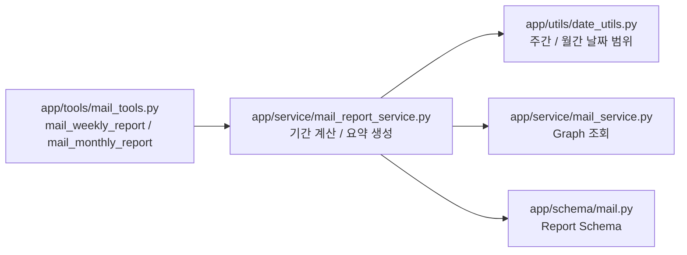

# MAIL_REPORT_GUIDE

## 목적

`app/` FastMCP 서버에서 주간/월간 메일 리포트 도구가 어떤 구조로 동작하는지 설명합니다.
리포트 도구는 단순 메일 조회가 아니라 보고서 작성에 필요한 목록과 요약 정보를 함께 반환합니다.

## 흐름



- `mail_weekly_report` 는 지난주와 이번주 메일을 함께 반환합니다.
- `mail_monthly_report` 는 지난달과 이번달 메일을 함께 반환합니다.
- 각 기간은 메일 목록, 안 읽음 수, 중요 메일 수, 첨부 메일 수, 주요 발신자, 요약 문장을 포함합니다.
- 관련 코드 경로는 `app/tools/mail_tools.py`, `app/service/mail_report_service.py`, `app/schema/mail.py`, `app/utils/date_utils.py` 입니다.

## 예시

전제조건:
- `cmn` 서버가 실행 중이어야 합니다.
- `app` 서버 요청에는 `biz-user-token` 헤더가 포함되어야 합니다.
- Microsoft delegated 권한에 `Mail.Read` 가 포함되어야 합니다.

복붙 가능한 MCP 입력 예시:

```json
{
  "top_k": 30
}
```

기대 결과:
- `mail_weekly_report` 는 `last_week`, `this_week`, `report_content` 를 반환합니다.
- `mail_monthly_report` 는 `last_month`, `this_month`, `report_content` 를 반환합니다.
- 각 기간 객체에는 `recent_mails`, `important_mails`, `top_senders`, `summary_text` 가 포함됩니다.

실패 예시:

```json
{
  "top_k": 500
}
```

해결 방법:
- 서비스가 내부에서 50건으로 제한하므로 동작은 하지만, 보고서 목적이라면 `top_k` 는 10~50 사이로 지정하는 것이 좋습니다.

## 설계 메모

요약은 LLM 호출 없이 코드에서 계산 가능한 집계 정보로 만듭니다.
대안으로 Graph 결과를 LLM 에 넘겨 자연어 요약까지 service 에서 생성할 수도 있지만, 그러면 비용과 지연 시간이 늘어나고 테스트가 어려워지는 트레이드오프가 있습니다.
