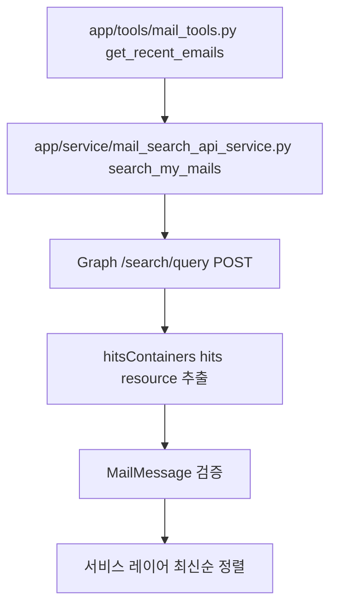

# MAIL_SEARCH_API_GUIDE

## 목적

`app/service/mail_search_api_service.py`는 Microsoft Graph `/search/query` API로 내 메일을 검색합니다.
이 API는 일반 `/me/messages` 조회와 응답 구조와 문법이 다르므로, `message` 엔티티 제약을 명시적으로 지켜야 합니다.

## 호출 흐름



`mail_tools.py`는 MCP 도구 입력을 받고, `mail_search_api_service.py`가 Graph 요청 바디를 만듭니다.
`/search/query` 응답은 `value`가 바로 메일 목록이 아니라 `hitsContainers[].hits[].resource` 안에 실제 메일이 들어 있습니다.
그래서 서비스에서 resource만 꺼낸 뒤 `MailMessage`로 검증합니다.

## Search API 주의사항

- `message` 엔티티는 `sortProperties`를 지원하지 않습니다.
- `sortProperties`를 넣으면 `SearchRequest Invalid (EntityRequest Invalid (Don't support sort for Message))` 오류가 발생합니다.
- `message/event` 검색의 `size`는 최대 25로 제한합니다.
- 날짜 검색은 KQL 문법에 맞게 `received>=MM/DD/YYYY AND received<=MM/DD/YYYY` 형태로 조합합니다.

## 예시

전제조건:

- Microsoft Graph `Mail.Read` 권한이 있는 access token
- MCP 요청 컨텍스트에 `graph_access_token`, `current_user`, `trace_id`가 설정되어 있어야 함

요청 예시:

```json
{
  "requests": [
    {
      "entityTypes": ["message"],
      "query": {
        "queryString": "(received>=05/07/2026) AND (received<=05/14/2026)"
      },
      "from": 0,
      "size": 10,
      "fields": [
        "id",
        "subject",
        "toRecipients",
        "sentDateTime",
        "from",
        "receivedDateTime",
        "importance",
        "isRead",
        "hasAttachments",
        "bodyPreview"
      ]
    }
  ]
}
```

기대 결과:

- Graph가 200 응답을 반환합니다.
- 서비스는 `hitsContainers[].hits[].resource`를 메일 목록으로 변환합니다.
- 최종 결과는 `receivedDateTime` 기준 최신순으로 정렬됩니다.

실패 예시:

```json
{
  "sortProperties": [
    {
      "name": "receivedDateTime",
      "isDescending": true
    }
  ]
}
```

해결 방법:

`message` 엔티티 검색에서는 `sortProperties`를 제거하고, 응답을 받은 뒤 파이썬 코드에서 정렬합니다.
