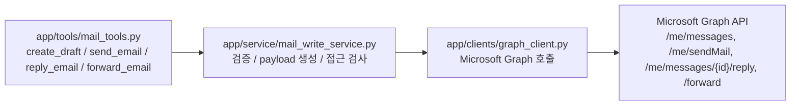

# MAIL_WRITE_GUIDE

## 목적

`app/` FastMCP 서버에서 메일 초안 생성, 즉시 발송, 답장 발송, 전달 도구가 어떻게 동작하는지 설명합니다.
현재 패턴은 조회 기능과 같이 `Tool -> Service -> Graph Client` 계층을 유지합니다.

## 흐름



- `mail_tools.py` 는 MCP 도구의 입력 이름, 설명, 사용 가이드를 정의합니다.
- `mail_write_service.py` 는 제목, 본문, 수신자 검증과 Graph payload 생성을 담당합니다.
- `graph_client.py` 는 Graph API 호출과 로그 저장만 담당합니다.
- 관련 코드 경로는 `app/tools/mail_tools.py`, `app/service/mail_write_service.py`, `app/clients/graph_client.py` 입니다.

## 도구

| 도구 | Graph API | 설명 |
| :-- | :-- | :-- |
| `create_draft` | `POST /me/messages` | 메일을 발송하지 않고 Drafts 에 초안으로 저장합니다. |
| `send_email` | `POST /me/sendMail` | 새 메일을 즉시 발송하고 보낸 편지함에 저장합니다. |
| `reply_email` | `POST /me/messages/{id}/reply` 또는 `replyAll` | 기존 메일에 답장을 발송합니다. |
| `forward_email` | `POST /me/messages/{id}/forward` | 기존 메일을 다른 수신자에게 전달합니다. |

## 예시

전제조건:
- `cmn` 서버가 실행 중이어야 합니다.
- `app` 서버 요청에는 `biz-user-token` 헤더가 포함되어야 합니다.
- Microsoft delegated 권한에 `Mail.ReadWrite`, `Mail.Send` 가 포함되어야 합니다.

복붙 가능한 MCP 입력 예시:

```json
{
  "subject": "회의 일정 확인",
  "body": "안녕하세요. 내일 오전 회의 가능하신지 확인 부탁드립니다.",
  "to_addresses": ["user@example.com"],
  "cc_addresses": []
}
```

기대 결과:
- `create_draft` 는 `status=draft_created` 와 생성된 메일 `id` 를 반환합니다.
- `send_email` 은 `status=sent` 를 반환합니다.
- `reply_email` 은 `status=reply_sent` 를 반환합니다.
- `forward_email` 은 `status=forwarded` 를 반환합니다.

실패 예시:

```json
{
  "subject": "제목만 있음",
  "body": "",
  "to_addresses": []
}
```

해결 방법:
- `body` 에 실제 본문을 입력합니다.
- `to_addresses` 에 최소 1개 이상의 수신자 이메일 주소를 넣습니다.

## 설계 메모

쓰기 기능은 조회보다 영향이 크므로 `send_email` 보다 `create_draft` 를 기본 안전 흐름으로 두는 것이 좋습니다.
대안으로 모든 메일 작성을 초안 생성만 허용하고 발송은 Outlook UI 에서 직접 하게 만들 수 있습니다.
그 방식은 안전하지만, 사용자가 명시적으로 자동 발송을 원하는 업무 자동화에서는 단계가 하나 더 늘어나는 트레이드오프가 있습니다.
