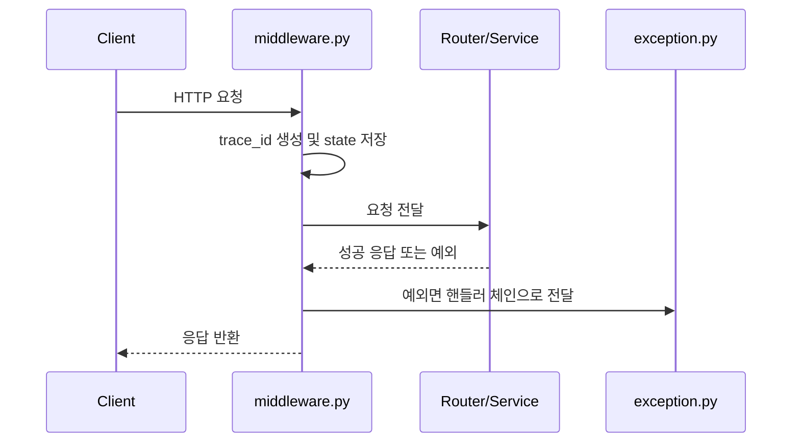

# MIDDLEWARE_ENTERPRISE_GUIDE

## 개요

이 문서는 `cmn/base/middleware.py`를 기준으로, FastAPI 서비스에서 요청/응답 미들웨어가 엔터프라이즈 패턴에서 어떤 역할을 가져야 하는지 정리한 학습 노트입니다.

관련 코드 경로:
- `cmn/base/middleware.py`
- `cmn/base/exception.py`
- `cmn/main.py`

## 이 모듈의 지향점

- 요청 시작 시 공통 컨텍스트를 만든다.
- 응답 종료 시 공통 로그를 남긴다.
- 예외가 나더라도 추적 가능한 로그를 남긴다.
- 라우터나 서비스가 로깅, `trace_id` 관리 책임을 직접 갖지 않게 한다.

## 미들웨어 흐름



- 미들웨어는 요청 초입에서 공통 컨텍스트를 세팅합니다.
- `trace_id`를 생성해 `request.state`에 저장하면 이후 예외 처리와 로깅이 같은 값을 공유할 수 있습니다.
- 응답이 성공이든 실패든 종료 시점 로그를 일관되게 남기는 것이 중요합니다.
- 관련 코드는 `cmn/base/middleware.py`, `cmn/base/exception.py`입니다.

## 엔터프라이즈 패턴에서 미들웨어가 맡는 책임

### 1. 공통 컨텍스트 초기화

- `trace_id`
- 요청 시작 시각
- 필요하면 사용자/회사 코드/상관관계 ID

문법 설명:
- `request.state.xxx`는 요청 단위 데이터를 저장하는 FastAPI/Starlette 패턴입니다.
- 같은 요청 안에서 여러 계층이 이 값을 공유할 수 있습니다.

### 2. 요청/응답 로깅

- 요청 메서드
- 경로
- 클라이언트 IP
- 응답 상태코드
- 소요 시간

왜 이렇게 했는지:
- 라우터마다 로그를 찍으면 형식이 흩어지고 누락되기 쉽습니다.
- 미들웨어 한 곳에서 통일하면 운영 관측성이 좋아집니다.

### 3. 민감 정보 보호

- `Authorization`
- `Cookie`
- API Key

헤더 전체를 그대로 남기면 운영 로그에 인증 정보가 유출될 수 있으므로 마스킹 또는 허용 목록 방식이 필요합니다.

### 4. 실패 흐름 안정성

예외가 나도 미들웨어가 2차 오류를 내면 안 됩니다.

예를 들어:
- `response`가 없는데 `response.status_code`를 읽으면 안 됩니다.
- 예외 시에도 최소한 `trace_id`, 경로, 소요 시간은 남겨야 합니다.

## 현재 프로젝트에서 배운 점

- `trace_id`는 미들웨어에서 가장 먼저 생성하는 것이 자연스럽습니다.
- 예외 핸들러와 미들웨어는 서로 경쟁하는 것이 아니라, `trace_id`를 공유하는 협력 관계입니다.
- 요청/응답 로그는 한 줄 포맷으로 일관되게 남기는 것이 운영에서 훨씬 읽기 쉽습니다.
- 성공 흐름보다 실패 흐름에서 2차 오류가 없는지가 더 중요합니다.

## 안티패턴

- 라우터마다 직접 `trace_id`를 만들고 로그를 찍는 것
- 예외 발생 시 미들웨어 자체가 또 실패하는 것
- 민감 헤더를 그대로 로그에 남기는 것
- 성공 응답에만 `trace_id`를 넣고 실패 응답은 놓치는 것

## 체크리스트

- 요청 시작 시 `trace_id`를 만들고 `request.state`에 저장하는가?
- 응답 성공/실패 모두 종료 로그가 일관되게 남는가?
- `response`가 없는 실패 흐름도 안전하게 처리하는가?
- 민감 헤더는 마스킹 또는 제외하는가?
- 예외 핸들러와 `trace_id` 정책이 연결되는가?

## 복붙 예시

전제조건:
- FastAPI에서 `BaseHTTPMiddleware` 또는 ASGI 미들웨어를 사용합니다.

예시:

```python
trace_id = request.headers.get("x-trace-id") or str(uuid.uuid4())
request.state.trace_id = trace_id
```

기대 결과:
- 같은 요청 안에서 미들웨어, 예외 핸들러, 서비스 로그가 같은 `trace_id`를 공유합니다.

실패 예시:
- 예외 발생 시 `response`가 없는데 `response.status_code`를 읽는 코드

해결 방법:
- `response = None`으로 시작하고, 종료 로그에서 `response is not None` 여부를 분기합니다.

## 대안과 트레이드오프

대안 1개:
- `BaseHTTPMiddleware` 대신 순수 ASGI 미들웨어 사용

트레이드오프 1개:
- ASGI 미들웨어는 더 정밀하고 강력하지만, 구현 난이도가 올라갑니다.

## 다음 단계

- 에러 응답에도 `x-trace-id` 헤더를 100% 보장하는 정책 정리
- 필요하면 request body / response body 로깅 정책 추가
- 대규모 트래픽 환경이면 ASGI 미들웨어 전환 검토
