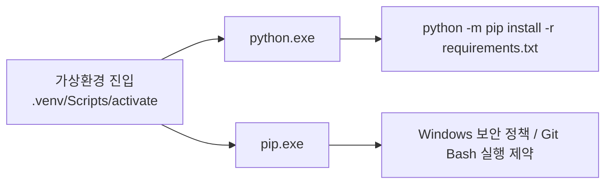

# WINDOWS_PIP_PERMISSION_GUIDE.md

Windows 환경에서 `pip install -r requirements.txt` 실행 시 `Permission denied`가 발생할 때 사용하는 가이드입니다.

## 문제 상황

실패 예시:

```bash
bash: \Users\LAPTOP-01\Desktop\workspace\mcp-mail\.venv/Scripts/pip: Permission denied
```

이 메시지는 보통 `pip.exe` 실행 파일이 Windows 보안 정책 또는 Git Bash 실행 방식에 의해 차단될 때 발생합니다.  
같은 가상환경이라도 `python.exe -m pip` 형태는 허용되는 경우가 많아서, 설치 명령은 `pip`보다 `python -m pip`가 더 안정적입니다.

## 빠른 해결 방법

전제조건:
- 저장소 루트가 `c:\Users\LAPTOP-01\Desktop\workspace\mcp-mail` 입니다.
- `.venv` 가상환경이 이미 생성되어 있습니다.
- 설치 대상 파일은 [requirements.txt](/c:/Users/LAPTOP-01/Desktop/workspace/mcp-mail/requirements.txt) 입니다.

### PowerShell

```powershell
.\.venv\Scripts\Activate.ps1
python -m pip install -r requirements.txt
```

기대 결과:
- `Successfully installed ...` 또는 이미 설치된 패키지 목록이 출력됩니다.

### Git Bash

```bash
source .venv/Scripts/activate
python -m pip install -r requirements.txt
```

기대 결과:
- `pip` 직접 실행 없이도 현재 가상환경의 Python으로 패키지가 설치됩니다.

### 활성화가 막힐 때 직접 실행

```powershell
.\.venv\Scripts\python.exe -m pip install -r requirements.txt
```

기대 결과:
- 셸 활성화 상태와 관계없이 `.venv` 내부 Python으로 설치가 진행됩니다.

## 동작 흐름



- `pip` 명령은 내부적으로 `pip.exe`를 직접 실행하는 경로를 탈 수 있습니다.
- 현재 저장소에서는 `.venv\Scripts\python.exe`가 살아 있어도 `pip.exe`만 차단될 수 있습니다.
- 그래서 설치 기준 명령을 `python -m pip`로 두면, 같은 가상환경을 쓰면서도 실행 차단을 우회할 수 있습니다.
- 관련 경로는 [README.md](/c:/Users/LAPTOP-01/Desktop/workspace/mcp-mail/README.md), [requirements.txt](/c:/Users/LAPTOP-01/Desktop/workspace/mcp-mail/requirements.txt) 입니다.

## 왜 이렇게 했는지

`python -m pip`는 "현재 실행 중인 Python 인터프리터에 연결된 pip 모듈"을 호출하는 문법이라서, 어떤 가상환경의 Python을 쓰는지가 더 명시적으로 드러납니다.  
특히 Windows에서는 `pip.exe`만 정책에 막히고 `python.exe`는 허용되는 경우가 있어, 같은 작업이라도 성공 확률이 더 높습니다.

## 대안과 트레이드오프

대안:
- PowerShell 또는 CMD에서 `.\.venv\Scripts\pip.exe install -r requirements.txt`를 직접 실행할 수 있습니다.

트레이드오프:
- 명령은 더 짧지만, 현재처럼 `pip.exe` 자체가 차단된 환경에서는 다시 같은 권한 오류가 날 수 있습니다.
