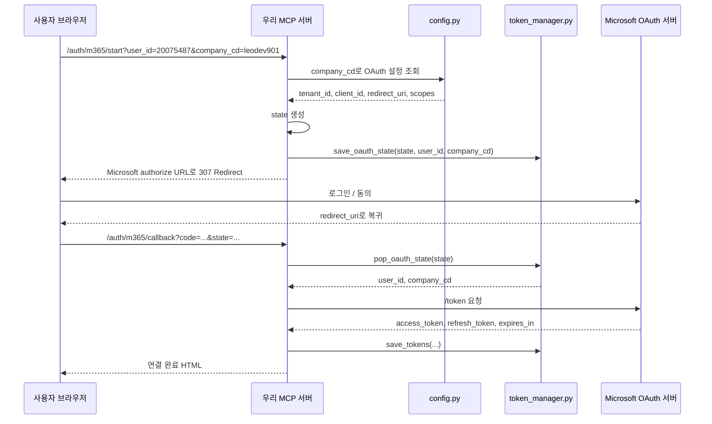

# Delegated Trasfor Step 3

## 문제 정의

Step 3의 목표는 실제 Microsoft 로그인 흐름을 서버에 붙이는 것이다.

이번 단계에서 다루는 범위:

1. OAuth 시작 라우트
2. OAuth 콜백 라우트
3. `main.py`에서 라우트 등록
4. 테스트 방법과 대표 에러 해석

관련 코드 경로:

- `app/routes/m365_oauth.py`
- `app/main.py`

---

## 접근 방법

FastMCP는 `custom_route()`를 통해 MCP Tool 외의 일반 HTTP 라우트를 추가할 수 있다.
이 라우트는 Tool 호출이 아니라 **브라우저가 직접 접근하는 엔드포인트**다.

현재 사용 라우트:

- `/auth/m365/start`
- `/auth/m365/callback`

왜 별도 라우트가 필요한가?

- 사용자가 Microsoft 로그인 / 동의를 해야 하기 때문이다.
- 로그인 후 Microsoft가 `code`와 `state`를 callback으로 넘겨주기 때문이다.

---

## m365_oauth.py 역할

관련 코드 경로:

- `app/routes/m365_oauth.py`

### 1. `/auth/m365/start`

브라우저에서 처음 열어야 하는 입구 URL이다.

예시:

```text
http://localhost:8003/auth/m365/start?user_id=20075487&company_cd=leodev901
```

이 라우트의 역할:

1. `user_id`, `company_cd`를 읽는다.
2. `config.py`에서 회사별 OAuth 설정을 읽는다.
3. 랜덤 `state`를 만든다.
4. `token_manager.save_oauth_state(...)`로 저장한다.
5. Microsoft authorize URL로 리다이렉트한다.

### 2. `/auth/m365/callback`

Microsoft 로그인 완료 후 되돌아오는 도착점이다.

이 라우트의 역할:

1. `code`, `state`를 읽는다.
2. `state`를 검증한다.
3. `/token` 엔드포인트에 POST 요청한다.
4. `access_token`, `refresh_token`, `expires_in`을 받는다.
5. `token_manager.save_tokens(...)`로 저장한다.
6. 연결 완료 HTML을 반환한다.

---

## OAuth 흐름 다이어그램

코드 경로:

- `app/routes/m365_oauth.py`
- `app/core/token_manager.py`
- `app/core/config.py`



핵심 이해 포인트:

- `state`는 우리 서버가 만든다.
- `code`는 Microsoft가 준다.
- 실제 토큰은 우리 서버가 `/token`에 다시 요청해서 받는다.

---

## main.py 역할

관련 코드 경로:

- `app/main.py`

`main.py`에서는 FastMCP 서버를 조립하면서
`register_m365_oauth_routes(mcp)`를 반드시 등록해야 한다.

예시 순서:

```python
register_calendar_tools(mcp)
register_mail_tools(mcp)
register_m365_oauth_routes(mcp)
mcp.add_middleware(MCPLoggingMiddleware())
```

왜 여기서 등록하는가?

- `mcp.http_app(...)` 호출 전에 라우트가 FastMCP 서버에 등록되어야 하기 때문이다.

---

## 테스트 방법

전제조건:

1. Azure App Registration에 Web Redirect URI 등록
2. `.env`의 `redirect_uri`가 Azure와 동일
3. `client_secret`에 Secret Value 입력
4. 서버 포트와 URL이 일치

### 1. 서버 실행

```powershell
.\.venv\Scripts\uvicorn.exe app.main:app --host 127.0.0.1 --port 8003
```

### 2. 브라우저에서 시작 URL 접속

```text
http://localhost:8003/auth/m365/start?user_id=20075487&company_cd=leodev901
```

### 3. 기대 로그

정상 흐름 예시:

```text
GET /auth/m365/start ... 307 Temporary Redirect
GET /auth/m365/callback?... ... 200 OK
```

정상 의미:

- `307`: Microsoft 로그인 페이지로 보내는 리다이렉트 성공
- `200`: callback에서 code 교환과 토큰 저장 성공

---

## 대표 에러와 해석

### 1. Redirect URI mismatch

실패 예시:

- `AADSTS50011`

원인:

- `.env`의 `redirect_uri`
- Azure App Registration의 Redirect URI
- 실제 서버 포트 / 호스트

이 세 개가 다르다.

해결 방법:

- `localhost` / `127.0.0.1`
- 포트
- `/callback` 경로

를 전부 완전히 같게 맞춘다.

### 2. Invalid client secret

실패 예시:

- `AADSTS7000215: Invalid client secret provided`

원인:

- `.env`에 Secret ID를 넣었거나
- 만료된 secret을 사용했거나
- 잘못 복사한 경우

해결 방법:

- `Certificates & secrets`에서 새 client secret 생성
- 생성 직후 보이는 `Value`를 `.env`에 넣는다.

### 3. Invalid or expired state

원인:

- `state`가 이미 사용되었거나
- 서버가 재시작되어 메모리 state가 사라졌거나
- 테스트 중 다른 프로세스로 바뀐 경우

해결 방법:

- `/auth/m365/start`부터 다시 시작
- `--reload` 없이 단일 프로세스로 테스트

### 4. TokenRecord 필드명 불일치

실패 예시:

- `TokenRecord.__init__() got an unexpected keyword argument 'company_cd'`

원인:

- `TokenRecord` 정의와 `save_tokens()` 호출의 필드명이 다름

해결 방법:

- `company_cd`, `refresh_token` 같은 이름을 전부 동일하게 맞춘다.

---

## 테스트 이후 해석

`/auth/m365/callback ... 200 OK`가 나왔다면
현재 단계에서는 OAuth 연결 자체가 성공한 것이다.

즉 아래가 성공한 상태다.

1. authorize 리다이렉트
2. Microsoft 로그인 / 동의
3. callback 복귀
4. token 교환
5. `token_manager.save_tokens(...)`

다만 아직 최종 완성은 아니다.
다음 단계에서는 이 저장된 토큰을 실제 Tool / Graph 호출에 연결해야 한다.

---

## 한 줄 요약

Step 3에서는 `m365_oauth.py`와 `main.py`를 통해
브라우저 기반 Microsoft 로그인, callback, 토큰 저장까지 실제 OAuth 흐름을 서버에 붙였고,
이제 다음 단계에서 저장된 토큰을 Tool / Graph 호출에 연결할 준비가 되었다.
