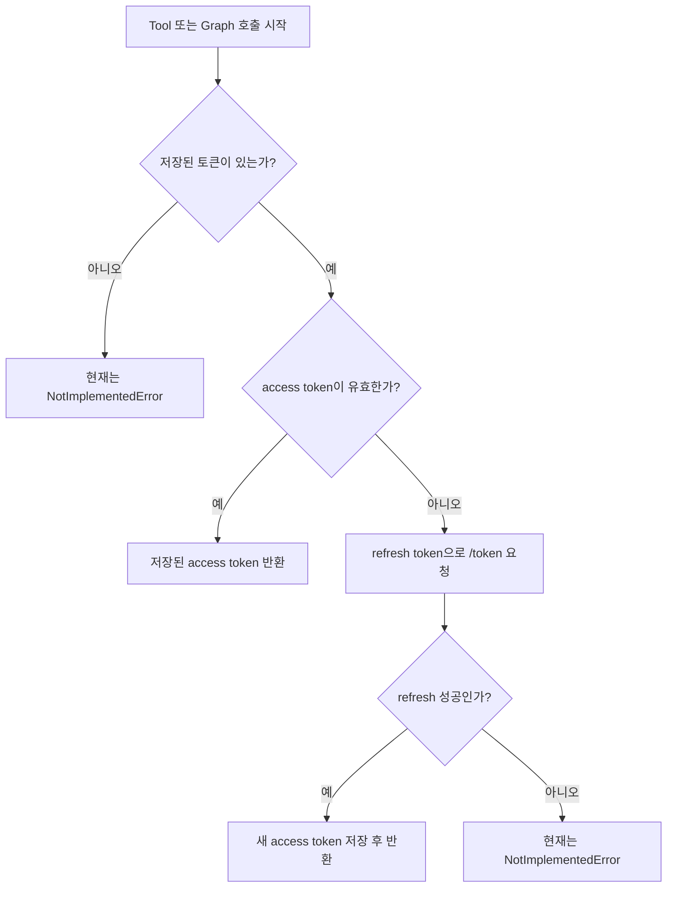

# Delegated Trasfor Step 4

관련 코드 경로:
- `app/core/token_manager.py`
- `app/core/config.py`
- `app/routes/m365_oauth.py`

## 문제 정의

Step 4의 목표는 `token_manager.py`를 단순 메모리 저장소에서
`사용자 토큰 정책 관리자`로 확장하는 것입니다.

여기서 `Token Manager`는 "토큰을 저장만 하는 객체"가 아니라
"지금 이 토큰을 바로 써도 되는지, refresh가 필요한지, 다시 동의가 필요한지 판단하는 관리자"라는 뜻입니다.

이번 단계에서 다루는 핵심 질문은 아래와 같습니다.

1. 저장된 사용자 토큰이 있는가?
2. 지금 access token이 아직 유효한가?
3. 만료되었다면 refresh token으로 갱신할 수 있는가?
4. 갱신도 실패하면 결국 어떤 피드백을 상위 계층에 줘야 하는가?

## 접근 방법

`Delegated Permission` 구조에서는 OAuth callback에서 토큰을 한 번 저장하는 것만으로 끝나지 않습니다.
실제 Tool이 Graph를 호출하는 매 순간마다 토큰 상태를 다시 판단해야 합니다.

그래서 `token_manager.py`는 아래 책임을 가지게 됩니다.

1. 토큰 저장과 조회
2. access token 만료 여부 판단
3. refresh token으로 재발급 요청
4. 토큰이 없거나 refresh 실패 시 재연결 필요 상태로 넘길 준비

왜 이렇게 했는지:
- 이 판단을 Tool마다 넣으면 메일, 일정, 드라이브 코드에 중복이 생깁니다.
- 토큰 정책을 한 곳에 모아야 이후 유지보수가 쉬워집니다.

대안:
- 각 Tool 파일에서 직접 refresh 처리

트레이드오프:
- 처음엔 단순해 보이지만 Tool마다 같은 예외 처리와 토큰 분기가 반복됩니다.

## 코드

### 1. 현재 `token_manager.py`의 주요 구성

#### `AuthRequiredError`

```python
class AuthRequiredError(Exception):
    def __init__(self, message: str, connect_url: str):
        super().__init__(message)
        self.message = message
        self.connect_url = connect_url
```

문법 설명:
- `Exception`은 파이썬 기본 예외 클래스입니다.
- `AuthRequiredError`는 우리가 직접 만든 `커스텀 예외(Custom Exception)`입니다.
- `connect_url`은 나중에 상위 계층이 사용자에게 "이 링크로 다시 연결하세요"라고 안내할 때 사용할 값입니다.

왜 필요한가:
- 단순한 `ValueError`보다 "재연결이 필요한 인증 문제"라는 의미를 더 정확히 표현할 수 있습니다.

#### `TokenRecord`

```python
@dataclass
class TokenRecord:
    user_id: str
    company_cd: str
    access_token: str
    refresh_token: str
    access_token_expires_at: datetime
```

문법 설명:
- `@dataclass`는 여러 필드를 묶어 다루기 쉽게 해주는 문법입니다.
- 여기서는 사용자 1명의 Microsoft 토큰 세트를 표현합니다.

#### `OAuthStateRecord`

```python
@dataclass
class OAuthStateRecord:
    user_id: str
    company_cd: str
    created_at: datetime
```

이 구조체는 OAuth 시작 단계에서 생성한 `state`와 연결된 임시 검증 정보를 담습니다.

### 2. 토큰 저장/조회 계층

현재 `token_manager.py`는 아래 메서드를 가집니다.

- `save_tokens(...)`
- `get_tokens(...)`
- `delete_tokens(...)`
- `save_oauth_state(...)`
- `pop_oauth_state(...)`

이 메서드들은 메모리 딕셔너리를 저장소처럼 사용하는 기본 계층입니다.

### 3. access token 유효성 판단

```python
def is_access_token_valid(self, user_id: str, company_cd: str) -> bool:
    record = self.get_tokens(user_id, company_cd)
    if record is None:
        return False

    return datetime.now(timezone.utc) < record.access_token_expires_at
```

문법 설명:
- `datetime.now(timezone.utc)`는 현재 UTC 시각을 뜻합니다.
- `<` 비교를 통해 만료 시각보다 현재 시각이 이전이면 아직 유효하다고 판단합니다.

왜 이렇게 했는지:
- access token은 짧은 수명 토큰이라 매번 유효성 판단이 필요합니다.
- 만료 직전 오차를 줄이기 위해 `save_tokens()`에서 미리 2분 정도 여유를 두고 저장합니다.

### 4. refresh token으로 access token 재발급

현재 `refresh_access_token(record)`는 아래 흐름으로 동작합니다.

```python
payload = {
    "client_id": configs["client_id"],
    "client_secret": configs["client_secret"],
    "grant_type": "refresh_token",
    "refresh_token": record.refresh_token,
    "redirect_uri": configs["redirect_uri"],
    "scope": configs["scopes"],
}
```

문법 설명:
- `grant_type="refresh_token"`은 "기존 refresh token을 사용해 새 access token을 달라"는 뜻입니다.
- `record.refresh_token`은 기존에 저장해 둔 사용자별 refresh token입니다.

왜 이렇게 했는지:
- access token은 짧게, refresh token은 길게 유지하는 것이 OAuth의 일반적인 패턴입니다.
- 사용자가 매번 다시 로그인하지 않도록 하기 위해 refresh 흐름이 필요합니다.

### 5. refresh token은 항상 같은 값인가?

아니요. Microsoft 응답에 새 refresh token이 오면 교체될 수 있습니다.

그래서 현재 코드처럼 아래 형태가 맞는 방향입니다.

```python
refresh_token = data.get("refresh_token", record.refresh_token)
```

문법 설명:
- `dict.get("refresh_token", record.refresh_token)`는 응답에 새 값이 있으면 그 값을 쓰고,
  없으면 기존 값을 유지하는 문법입니다.

### 6. refresh token 수명 이해

지금 구조는 `Web Redirect URI`를 사용하는 서버형 앱 기준입니다.
일반적으로 refresh token은 장기 토큰으로 이해하면 되고, 학습 관점에서는 보통 `90일 기준`으로 이해하면 됩니다.

다만 주의할 점이 있습니다.

- 실제 만료 시각이 클라이언트에 직접 내려오지 않을 수 있습니다.
- 보안 정책, 관리자 조치, revoke로 인해 더 빨리 무효화될 수 있습니다.
- 그래서 코드 설계는 "오래 간다"보다 "언제든 실패할 수 있다"를 기준으로 해야 합니다.

### 7. `resp.raise_for_status()`를 제거한 이유

처음에는 아래처럼 많이 작성합니다.

```python
resp.raise_for_status()
```

이 메서드는 4xx, 5xx 응답이 오면 바로 예외를 던집니다.

하지만 Step 4에서는 아래 같은 "실패 후 후처리"가 필요합니다.

- 저장 토큰 삭제
- 재연결 필요 상태 준비
- 향후 `connect_url` 생성

그래서 지금은 아래처럼 직접 분기하는 구조가 더 학습하기 좋습니다.

```python
if resp.status_code != 200:
    raise NotImplementedError(...)
```

왜 이렇게 했는지:
- 실패 지점에서 우리가 원하는 정책을 스스로 정의할 수 있습니다.
- 단순 HTTP 예외보다 OAuth 재연결 흐름을 설명하기 쉽습니다.

## 검증

### 현재 Step 4에서 확인할 것

1. OAuth callback 성공 후 `save_tokens(...)`가 정상 호출되는지
2. `get_tokens(...)`로 같은 사용자 키에서 레코드가 조회되는지
3. `is_access_token_valid(...)`가 만료 전에는 `True`인지
4. `refresh_access_token(...)`가 새 access token을 반환하는 구조인지

### 테스트 시 주의할 점

현재 저장소는 메모리 기반입니다.

즉 아래처럼 별도 프로세스로 실행하면:

```powershell
python .\app\test.py
```

서버 프로세스 메모리를 공유하지 않으므로 `None`이 나올 수 있습니다.

이건 이상한 현상이 아니라 현재 구조상 자연스러운 결과입니다.

### 현재 미완성인 부분

현재 `token_manager.py`에는 아직 `NotImplementedError`가 남아 있습니다.

남아 있는 지점:
- refresh 응답이 200이 아닐 때
- refresh 응답에 `access_token`이 없을 때
- 저장된 토큰이 아예 없을 때

이 부분은 다음 정리 단계에서 아래 흐름으로 바뀔 예정입니다.

```text
토큰 없음 / refresh 실패
-> 재연결 필요 상태 생성
-> connect_url 전달
-> LLM이 사용자에게 브라우저 연결 안내
```

## Mermaid 흐름도



설명:
- `token_manager.py`는 Tool과 Graph 사이에서 토큰 상태를 판단하는 중간 관리자입니다.
- access token이 살아 있으면 그대로 반환합니다.
- 만료되면 refresh token으로 새 access token을 요청합니다.
- 아직은 실패 분기가 `NotImplementedError`지만, 다음 단계에서 재연결 정책으로 바뀝니다.

## 한 줄 요약

Step 4에서는 `token_manager.py`를 통해 저장된 사용자 토큰의 유효성 판단과 refresh 흐름을 붙였고,
지금은 토큰 없음/refresh 실패 분기만 추후 `재연결 안내` 구조로 마무리하면 되는 상태입니다.
